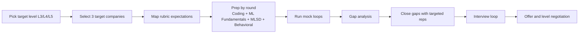

<LessonHero course="MLE Interview" title="Rubrics and playbook" subtitle="How ML interviews are scored and exactly how to prepare" />

This lesson translates interview ambiguity into a concrete playbook:
- **What is tested** in top-company MLE loops
- **How L3/L4/L5 differ** in evidence expected
- **What to prioritize** in preparation to maximize offer probability

:::warning[High-signal insight]
For senior candidates, coding is usually a gate, not the winning signal.  
Final level decisions are often driven by **ML system design depth**, **behavioral scope**, and **project impact quality**.
:::

## 1) L3 vs L4 vs L5 rubric map

| Target Level | Primary Rubric | What Interviewers Probe | What Strong Evidence Looks Like |
|---|---|---|---|
| L3 / Entry | Execution quality | Coding correctness, ML basics, coachability | Well-scoped projects, clean implementation, clear debugging |
| L4 / Mid | Independent ownership | End-to-end delivery, metrics, design structure | 1-2 shipped systems with measurable impact |
| L5 / Senior | Technical leadership | Cross-team influence, tradeoff depth, strategic judgment | Multi-quarter ownership, mentoring, architecture decisions |

:::tip[How to reduce downlevel risk]
When targeting L5, prepare at least 3 stories where you influenced teams beyond your own and can quantify business impact.
:::

## 2) Round priorities and readiness trends

<MLEInterviewCharts />

## 3) Top-company loop differences (2025-2026)

| Company | Veto / Gate | Distinctive Rubric Focus | Recent Shift |
|---|---|---|---|
| Google | Hiring Committee consensus | ML domain + MLSD + coding + communication | More LLM/RAG prompts in ML rounds |
| Meta | Behavioral failure is terminal | Coding decides hire; MLSD + behavioral decide level | AI-assisted coding rounds rolled out |
| Amazon | Bar Raiser formal veto | Leadership Principles + data-backed STAR + MLSD | Heavy Bedrock/SageMaker tradeoff probing |
| Microsoft | As-Appropriate senior gate | Responsible AI + product-aligned ML design | Copilot and enterprise-safe AI constraints |
| Apple | Team consensus, opaque leveling | On-device constraints, privacy, optimization | More edge AI and model compression questions |
| Netflix | Director "Dream Team" culture gate | Tradeoff judgment over framework recitation | Causal/experimentation rigor increasingly important |
| OpenAI | Committee consensus | LLM internals + infra + safety-aware reasoning | More from-scratch transformer implementation |
| Databricks | VP final review | Spark/Delta/MLflow + platform depth | Compound AI and multi-model orchestration |
| Stripe | Leveler calibration | Bug squash + applied fraud/risk ML | Writing and communication carry high weight |
| Uber | XFN bar-raiser analog | Real-time ML + marketplace constraints | Guardrails/cost in AI-enabled systems |
| Airbnb | XFN can tank strong technical loops | Debugging and mission alignment | AI trip planning and agentic product prompts |
| LinkedIn | Centralized hiring committee | Graph/recsys depth + communication quality | AI-product and policy-safe design emphasis |
| Snowflake | Panel + HM consensus | SQL-native ML and data-cloud architecture | Cortex AI and text-to-SQL use cases |

## 4) 8-week prep roadmap

| Phase | Learning Objective | What To Practice | Exit Criteria |
|---|---|---|---|
| Week 1-2 | Fundamentals reset | Stats, optimization, evaluation, bias-variance | Solve 40 targeted ML concept drills |
| Week 3-4 | Coding + implementation | LC medium/hard + NumPy ML from scratch | Implement logistic regression + k-means quickly |
| Week 5-6 | ML system design | Classical + GenAI system design reps | Complete 8-10 full design walkthroughs |
| Week 7 | Behavioral and project stories | STAR/SAIL mapped to target company values | 6 polished stories with metrics and lessons |
| Week 8 | Mock loops + calibration | Full loop simulations and feedback closure | Ready signal on level-specific rubric |

:::note[Prep sequence]
Do not randomize preparation.  
Follow the order: **fundamentals → coding → MLSD → behavioral → mocks**.
:::

## 5) End-to-end interview flow

## 6) What AI Engineering courses contribute to interview success

| AI Engineering Track Area | Interview Round Lift |
|---|---|
| Regression and optimization foundations | ML fundamentals + derivation questions |
| CNN/RNN/Transformer internals | ML depth + architecture reasoning |
| GPT/LLM building blocks | GenAI design + coding rounds |
| System-building projects | MLSD structure + tradeoff clarity |
| Interview-readiness lessons | Behavioral articulation + confidence under pressure |

:::tip[Practical positioning line]
"I did not just learn model theory; I built and reasoned about production constraints, tradeoffs, and failure modes."  
This framing consistently performs well in MLE interviews.
:::

## 7) ML System Design course — your prep path for the most-weighted round

The [ML System Design course](/courses/ai-for-engineering/ml-system-design/) is the canonical preparation path for the round that most often decides senior-level outcomes. It walks the **6-step framework (PDATDM — Problem → Data → Architecture → Training → Deployment → Monitoring)** end-to-end across two reverse-engineered production systems and four transfer case studies.

| Course module | What you reverse-engineer | When to prioritise |
|---|---|---|
| [**Lesson 0 — The 6-step framework**](/courses/ai-for-engineering/ml-system-design/the-ml-sd-interview) | The interview itself: how the round runs, what L4 vs L5 candidates do | Read first, regardless of target role |
| [**Lessons 1–7 — YouTube recsys**](/courses/ai-for-engineering/ml-system-design/recsys-define-the-problem) | Two-tower retrieval, deep ranker, calibration, A/B testing, monitoring | Recsys / ranking / feed / ads roles |
| [**Lessons 8–11 — Production RAG**](/courses/ai-for-engineering/ml-system-design/rag-define-the-problem) | Chunking, hybrid retrieval, LLM serving, faithfulness eval | Search / assistant / Copilot / Bing / Gemini-class roles |
| [**Lesson 12 — Ad CTR case study**](/courses/ai-for-engineering/ml-system-design/case-ad-ctr-prediction) | GSP auction mechanics, calibration as revenue gate | Ads / monetisation roles |
| [**Lesson 13 — Real-time fraud**](/courses/ai-for-engineering/ml-system-design/case-real-time-fraud-detection) | Class imbalance, adversarial drift, asymmetric cost-curve threshold | Fraud / risk / safety roles |
| [**Lesson 14 — ETA prediction**](/courses/ai-for-engineering/ml-system-design/case-eta-prediction) | Spatial-temporal features, pinball loss, P50 / P90 quantile outputs | Maps / logistics / ride-hailing / delivery roles |
| [**Lesson 15 — Multimodal search**](/courses/ai-for-engineering/ml-system-design/case-multimodal-search) | CLIP-style InfoNCE contrastive joint training, cross-modal recall | Image search / visual products / multimodal AI roles |
| [**Interview readiness**](/courses/ai-for-engineering/ml-system-design/interview-readiness) | Two fully narrated 45-minute mock rounds (recsys + RAG), L4/L5 signals consolidated, day-of playbook | Read the day before any senior loop |

:::tip[How to use this in your 8-week roadmap]
The "MLSD" line in the Week 5–6 prep table above is the entire ML System Design course. Open the framework primer in Week 5; pick one flagship reverse-engineering plus one or two case studies most aligned to your target role; finish with the Interview Readiness mock-round walkthroughs in Week 6.
:::
