# Deep Learning for Computer Vision and Convolutional Neural Networks (CNNs)

## Chapter 1: Teaching Machines to See — The Fundamentals of Computer Vision

## Introduction to Vision as a Human and Machine Capability

Vision is arguably one of the most powerful and complex senses possessed by biological organisms. It’s our primary means of understanding the physical world: detecting emotion in a face, navigating through a crowded street, reading a traffic light — all happen almost instantaneously and often subconsciously. But what if we could endow machines with the same perceptual ability?

This chapter explores how we can program machines — especially deep learning models — to perceive and interpret the world visually. In other words, we're aiming to replicate the capability of sight in computers using raw image inputs.

---

## What is Vision, Conceptually?

At its most essential definition, **vision is the ability to determine "what is where by looking."** But this deceptively simple idea hides immense complexity. Consider how much context you subconsciously interpret when looking at a single image:

- What objects are present?
- Where are they located?
- Are they moving or stationary?
- What are their relationships to each other?
- What might happen next?

This act of perception isn’t just about labeling pixels — it involves **spatial reasoning**, **temporal inference**, and even **predictive modeling**.

---

## Static vs. Dynamic Perception

Human vision doesn’t just recognize objects statically; it understands them **dynamically**. For instance, consider an urban street scene:

- A white van parked on the left side of the road is understood to be **static**.
- A sedan in motion in the same frame is interpreted **differently** — even though both are visually "cars."
- Pedestrians on the sidewalk versus those crossing the street are perceived in terms of **action and intention**.
- A red traffic light implies **upcoming behavior** from moving vehicles.

This is critical: vision is not just about detecting what is in the image — it's also about **understanding how things interact over time**.

Human vision inherently reasons about **temporality**, **intent**, and **dynamics**, and our goal is to instill a similar **representational** and **inferential** power in computer vision systems.

---

## Why Computer Vision Matters

Computer vision powers real-world applications such as:

- **Autonomous driving**: detecting lane boundaries, pedestrians, traffic signs.
- **Medical image analysis**: identifying tumors from scans.
- **Augmented reality and robotics**: spatial mapping, scene understanding.
- **Industrial automation**: defect detection in manufacturing.

These systems must do more than **classify** — they must **perceive the scene**, **predict changes**, and **react accordingly**, all in **real-time**.

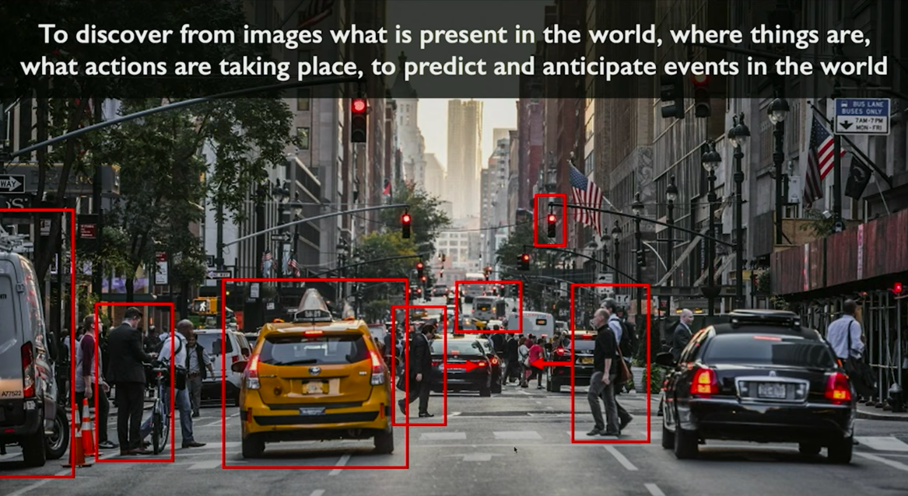 
# Chapter 2: Deep Learning's Transformative Role in Computer Vision

## The Deep Learning Revolution in Visual Understanding

In the past decade, deep learning has transformed the landscape of computer vision. What was once a field defined by handcrafted features, pipelines of rule-based heuristics, and brittle performance is now dominated by end-to-end models that learn directly from raw pixels.

This shift is not just an incremental improvement. It is a foundational rethinking of how machines perceive and interpret visual information. Deep neural networks have become the primary engine for visual perception tasks across industries and platforms, from large-scale robotics systems to compact mobile devices.

## Real-World Applications: From Cloud to Edge

Computer vision is no longer confined to research labs or high-end servers. Today, it runs in your pocket.

Modern smartphones ship with multiple vision models embedded in their hardware. These models power tasks such as real-time face recognition for authentication, scene segmentation for photo enhancement, and even depth estimation to support augmented reality.

Embedded vision is also key to autonomous drones, smart glasses, and wearables. These edge devices operate with strict latency and power constraints, yet they perform complex visual inference tasks. The deep learning models they use are highly optimized, often quantized, and sometimes trained using transfer learning from larger models.

## Vision in Healthcare and Biology

In healthcare and biology, deep learning offers capabilities that rival expert-level human performance.

Computer vision systems now analyze medical images such as X-rays, MRIs, and pathology slides to detect anomalies, classify tissue types, and even estimate disease progression. Importantly, they can detect subtle features that are often overlooked by human observers, and they do so with consistency and speed.

For instance, retinal imaging models assist ophthalmologists in diagnosing diabetic retinopathy. In radiology, convolutional networks help prioritize scans with potential tumors for urgent review. These tools are reshaping diagnostic workflows and expanding access to expert-grade medical analysis.

## Self-Driving Cars: A Grand Challenge for Vision

Autonomous driving represents one of the most complex and high-stakes applications of computer vision.

One of the hallmark projects in this domain was developed at MIT. Unlike the traditional approach of building a pipeline of modular subsystems—one for perception, one for planning, another for control—this project involved building an end-to-end model. The model learned to drive directly from raw visual input without relying on predefined maps.

The input to the model was the raw image stream from front-facing cameras. The output was driving commands. This method is elegant but challenging, as it requires the model to implicitly learn navigation, obstacle avoidance, traffic rule compliance, and more, just from visual input.

What made this project significant was that the system could generalize to unseen roads. It did not need prior knowledge of the environment. This points toward a future where vision-based autonomy might not require detailed HD maps or handcrafted priors.

## Classical to Contemporary: Facial Recognition as a Case Study

One of the earliest and most impactful applications of computer vision was facial detection. Initially, the goal was simple: detect whether or not a face is present in an image.

With deep learning, this problem has evolved dramatically. Modern models not only detect faces but also extract nuanced features such as facial landmarks, gaze direction, and micro-expressions. These features allow systems to estimate emotional state, detect identity under occlusion, and even track attention in real-time.
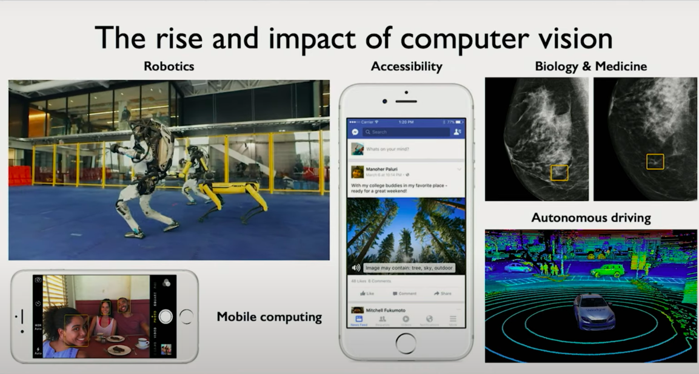
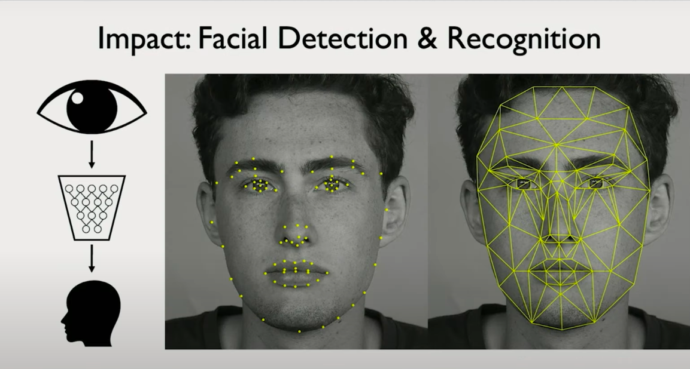
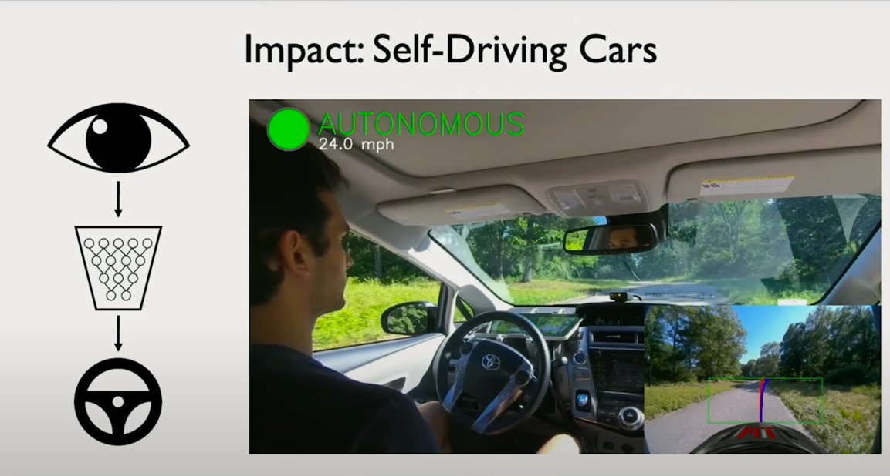
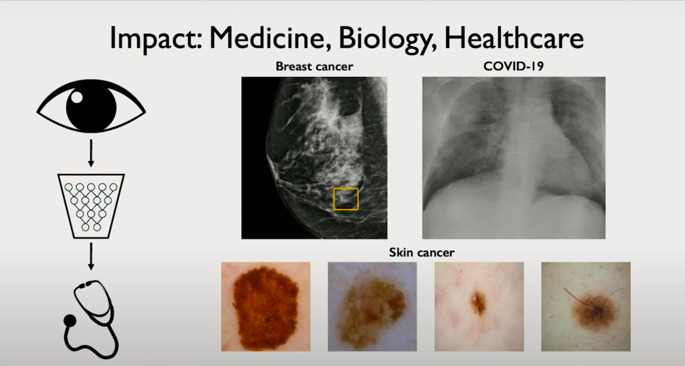

# Chapter 3: From Pixels to Perception — How Computers Interpret Images

## Bridging Human Intuition and Machine Perception

In today’s class, we begin to transition from high-level applications to the underlying mechanics that enable them. The central question is both philosophical and technical: **how can we take a task that humans perform effortlessly and encode that capability into machines?**

For example, recognizing a face, distinguishing between two objects, or interpreting a scene are actions we perform with no conscious thought. Yet each of these tasks requires a series of complex perceptual computations.

> The goal is to design models that can perform such tasks with the same level of efficiency and accuracy, despite the lack of human intuition.

---

## How Computers Represent Images

At the lowest level, images are fundamentally numerical. While to us an image of Abraham Lincoln is a coherent visual entity, to a computer it is nothing more than a structured set of values.

- In **grayscale images**, each pixel is represented by a single intensity value.
- In **color images**, each pixel is represented by a triplet of numbers corresponding to **red**, **green**, and **blue** intensities.

This leads to two primary types of image representations:

- **Grayscale Image**: Represented as a 2D matrix of shape `(height, width)`
- **Color Image**: Represented as a 3D tensor of shape `(height, width, 3)`

This structured representation is ideal for feeding into neural networks. Unlike text, which must be tokenized and embedded, images are already in a **dense numerical format**. The challenge is not converting them into numbers, but **interpreting** the numbers meaningfully.

---

## Understanding the Learning Tasks: Regression and Classification

Once an image is represented numerically, we can train deep learning models to perform specific tasks. These tasks typically fall into two broad categories:

### Regression

- **Outputs** continuous values.
- **Examples in vision**:
  - Predicting the age of a person from a face image
  - Estimating the depth of each pixel in a scene
  - Forecasting motion vectors

### Classification

- **Outputs** discrete class labels.
- **Example**: Given an image of a historical figure, determine whether it is Abraham Lincoln, George Washington, or another U.S. president.
- The output is one of **K** possible categories, and the model must learn to assign high probability to the correct one.

> The classification task is central to many computer vision problems. For a model to classify images correctly, it must first learn to identify the features that distinguish one class from another.

---

## Feature Extraction: The Key to Recognition

Let’s ground this with an example: identifying whether a portrait is Abraham Lincoln or George Washington. Humans rely on distinctive features such as:

- Facial structure  
- Hairstyle  
- Beard or lack thereof  
- Historical clothing artifacts

For a machine to do this, it must also extract features — but unlike humans, it needs these features to be either **explicitly defined** or **automatically learned**.

This brings us to the heart of deep learning for vision: **representation learning**.

Neural networks learn to extract features from raw pixels through successive layers of:

- **Convolution**
- **Pooling**
- **Non-linear transformation**

- Lower layers capture **local edges and textures**.
- Deeper layers capture **higher-level abstractions** such as facial parts or spatial arrangements.

By learning a hierarchy of features, the network becomes capable of associating specific patterns with specific labels.

---

## Summary

In this chapter, we have laid the foundation for understanding how deep learning systems interpret images. The pipeline begins with raw pixel arrays and flows into two core types of learning problems: **regression** and **classification**.

### Key insights:

- Images are **structured arrays of numbers**, inherently suitable for machine interpretation.
- Classification tasks require models to **detect and leverage features** that separate one class from another.
- Deep networks automate this **feature extraction** through layers of learned filters, enabling models to understand visual patterns with increasing abstraction.
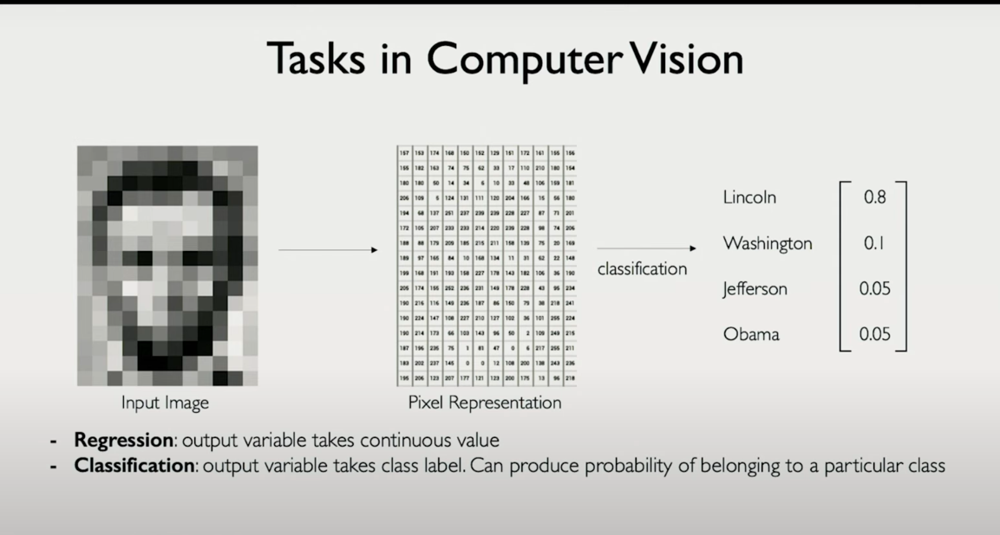
# Chapter 4: The Challenge and Power of Feature Detection

## The Essence of Visual Classification
At the heart of any image classification problem lies the task of feature detection. Fundamentally, classification is a two-step process:  
Define what you are trying to detect.  
Detects those features in new images.

For instance, if you are trying to classify an image as a human face, you might define the necessary features as eyes, a nose, and a mouth. Once these components are detected in the image, you gain confidence that the object is indeed a face. Similarly, if you are trying to detect a house, you might define features such as doors, windows, and rooftops. The more of these features the system detects, the more confident it becomes in its classification.

This process may appear intuitive, but building a system that performs it reliably across diverse inputs is highly nontrivial.

## Why Feature Detection is Harder Than It Looks
The difficulty arises from two core challenges:  
**Feature Hierarchy and Recursion**

- To detect a face, you must detect eyes.  
- But to detect eyes, you now have a subproblem that is structurally identical to the original problem.  
- Each feature itself requires its own sub-feature detection process.  
- This introduces a hierarchical structure where higher-level features are composed of lower-level ones.

**High Variability in Input Space**

A single object class, such as a face, can appear vastly different depending on:

- Lighting conditions  
- Pose and orientation  
- Occlusion (e.g. sunglasses, hats, shadows)  
- Camera sensor differences  
- Scale and resolution

In raw pixel space, even small transformations can lead to large changes in numerical values.  
This makes it hard for classical machine learning models to generalize, as they are sensitive to exact pixel patterns.

## The Limitations of Classical Machine Learning
In traditional machine learning, feature engineering is a manual process.  
Domain experts are responsible for defining what to look for in the data. For image tasks, this means designing filters or extracting geometric and statistical descriptors like SIFT, HOG, or edge detectors.  
While effective in constrained settings, this approach fails under real-world variation. It lacks adaptability and requires constant tweaking for new tasks or domains.

Most importantly, these hand-engineered pipelines are brittle. If the features are poorly chosen or do not generalize, the performance collapses. The system’s success depends entirely on human insight and intuition.

## Deep Learning as the Paradigm Shift
Deep learning offers a different philosophy. Instead of explicitly defining features, we learn them from data.  
Convolutional neural networks (CNNs), the backbone of modern computer vision, are structured to automatically learn hierarchical features from raw pixels. Lower layers learn edges and textures. Middle layers capture parts and shapes. Higher layers learn object-level abstractions.  
This automatic feature learning solves both core problems outlined earlier:

- Hierarchy is built into the model architecture through stacked layers.  
- Invariance is achieved by training on diverse data and learning filters that generalize across scale, rotation, brightness, and more.

What was previously a manual, error-prone, and brittle process is now a scalable, data-driven, and highly robust pipeline.

## Summary
Feature detection is the bottleneck in classical machine learning for computer vision.  
Real-world classification tasks involve massive input variation and hierarchical dependencies.  
Deep learning replaces hand-crafted feature engineering with automatic representation learning.  
This shift enables scalable, general-purpose models that outperform classical methods in virtually every vision benchmark.

As we move forward, we will dive into how convolutional layers are specifically designed to perform this automatic feature extraction process with mathematical precision and computational efficiency.
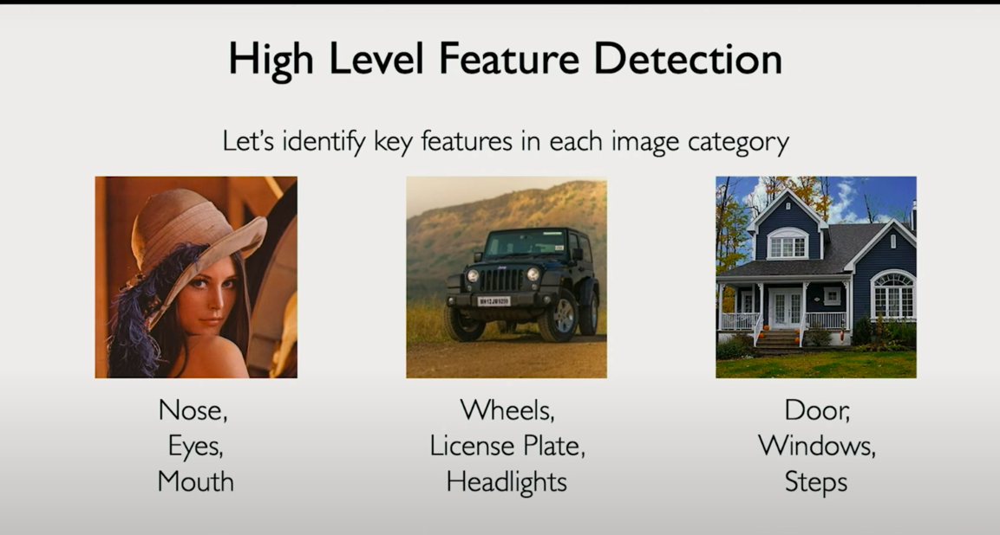
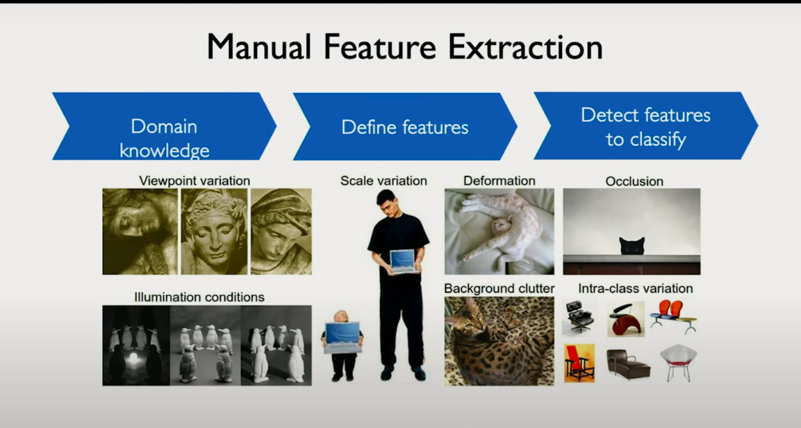
# Chapter 5: Learning Features Directly from Data with Neural Networks

## Moving Beyond Human-Defined Features
Traditionally, computer vision systems depended on human-designed feature extractors. A developer might explicitly define that to detect a face, one must first detect eyes, ears, and noses. To go further, they might break those down even more — for instance, to detect an ear, look for a vertical line followed by a semicircle.

This recursive manual engineering is fragile, time-consuming, and hard to generalize. What if, instead, we could eliminate this step entirely?  
This is exactly what deep learning enables. Rather than define features, we learn them directly from raw data.  
The new paradigm:  
Feed the model a large dataset of images (e.g. faces).  
Let the model figure out which patterns of pixels are most useful for distinguishing these images from others (e.g. cars, trees, or other objects).  
Do this automatically, across many layers, with increasing abstraction.

---

## Hierarchy Through Depth
The key architectural insight lies in depth. A neural network is composed of many layers, each transforming the image representation in a structured, learnable way.  
Early layers learn simple features like edges and textures.  
Middle layers build on these to form motifs like eyes, wheels, or leaf patterns.  
Deeper layers combine these motifs into object-level understanding — faces, vehicles, animals, etc.

This progression is not manually programmed. It emerges from training data through backpropagation and gradient descent.  
Each layer's role is to extract more abstract, more informative features from the layer below it. The deeper the network, the more complex the learned representations become.

---

## Why This Works
The power of this approach lies in the distributed and compositional nature of representations in deep neural networks:  
**Distributed:**  
No single neuron defines a concept. Instead, many neurons jointly encode patterns.  
**Compositional:**  
High-level features are composed of lower-level ones, learned through successive transformations.

What makes this powerful in vision is the sheer variability in how objects appear: lighting, pose, occlusion, and background noise. Instead of hand-coding every edge case, we allow the model to generalize from examples.  
Given enough data and a sufficiently expressive model, the network can learn to tease apart the subtle cues that distinguish one object class from another — without any explicit definition of what a nose, a car, or a building looks like.

---

## Revisiting Our Example
Suppose we want to distinguish faces from cars.  
In a traditional system, we might specify that faces have eyes, noses, and mouths, and cars have wheels, headlights, and windshields.  
In a deep learning system, we feed thousands of labeled examples of faces and cars.  
The network’s convolutional layers learn discriminative patterns at every level — from low-level gradients to high-level semantic structures.  
Over time, the network builds a hierarchy of features tuned specifically to the task at hand.

No manual feature engineering is involved. The data drives the representations.

---

## Summary
Human-defined features are limited by our intuition and manual effort.  
Neural networks eliminate the need for handcrafted feature pipelines by learning representations directly from data.  
Hierarchical structure arises naturally from network depth, enabling increasingly abstract features to emerge.  
This approach makes models more adaptive, more robust to real-world variation, and ultimately more performant across vision tasks.

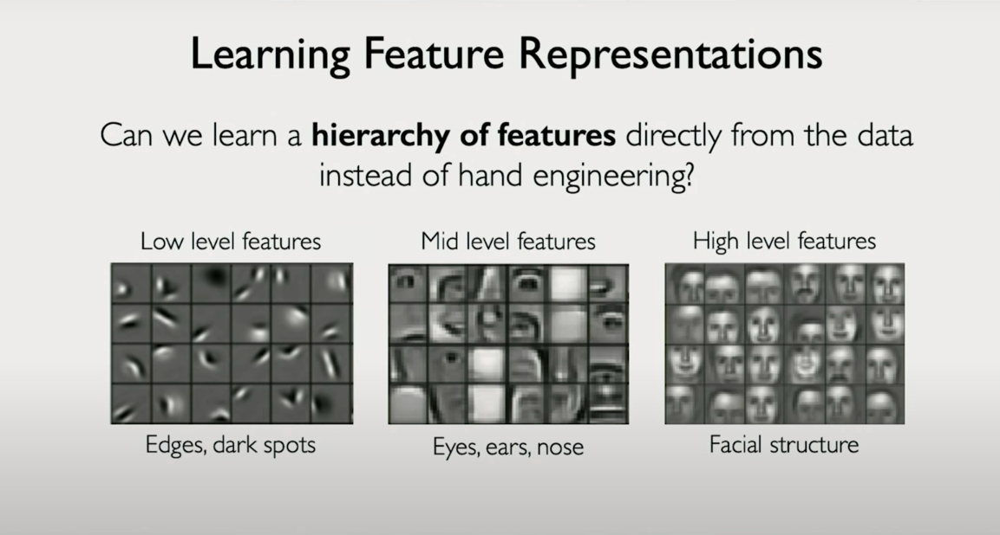

# Chapter 6: Preserving Spatial Structure with Convolutional Neural Networks

## The Limits of Fully Connected Networks in Vision
In Lecture 1, we explored fully connected neural networks  models where each neuron in one layer is connected to every neuron in the previous layer. This structure works well for problems where the input is one-dimensional or where spatial locality is not important.

But images are fundamentally different.  
An image is a two-dimensional structure — width and height (and possibly channels for color). Every pixel has spatial meaning: a pixel next to another shares more visual relevance than one on the opposite side of the image. Flattening this structure into a one-dimensional vector destroys this locality.

Let’s say we flatten a 100×100 image (grayscale). That’s a vector of size 10,000. If our hidden layer has 1,000 neurons, we now have 10 million parameters just between two layers. Worse, we’ve lost all of the rich structure that defines images  edges, shapes, orientation, and locality.  
This is computationally inefficient and conceptually unsound.

## What We Need Instead
To model vision tasks effectively, we need a network architecture that:

- Preserves the spatial arrangement of pixels  
- Maintains local connectivity (pixels that are near each other matter most)  
- Is parameter-efficient, sharing computations across regions of the image  
- Builds hierarchical features, where local patterns form edges, shapes, and entire objects

This is the idea behind Convolutional Neural Networks (CNNs).

## Local Connectivity and Weight Sharing
Instead of connecting every input pixel to every neuron in the next layer, CNNs use local receptive fields in small patches of the input image.

Let’s say we use a filter (also called a kernel) of size 4×4. This filter is a small set of weights (just 16 numbers) that will be applied across the image:  
- The first output neuron in the next layer is computed by applying this filter to the top-left 4×4 patch of the image.  
- The next neuron is computed by applying the same filter to the next 4×4 patch, shifted one pixel to the right.  
- This continues across the entire image.

This operation is called a convolution.  
**Key characteristics:**

- **Locality:**  
  Each neuron sees only a small patch of the input (local features).  
- **Weight sharing:**  
  The same filter is used everywhere in the image, which drastically reduces parameters.  
- **Translation invariance:**  
  Because the same filter is applied across locations, the network can detect a pattern regardless of where it occurs.

This is fundamentally different from fully connected layers, where each neuron has a separate weight for every input pixel.

## What is a Convolution?
A convolution is a sliding, element-wise multiplication operation followed by a sum, bias addition, and nonlinearity.  
Here’s how it works:

- Take a small patch of the input image — say, a 4×4 region.  
- Multiply it element-wise with the 4×4 filter.  
- Sum the result into a single number.  
- Add a bias term.  
- Pass the result through a nonlinearity (like ReLU).  
- Shift the filter (by a stride of 1 or 2 pixels), and repeat.

The result is a new matrix, called a **feature map**, which encodes where and how strongly a certain pattern appears in the image.  
By stacking multiple filters, we extract multiple types of features — edges in different directions, textures, corners, etc.

## Why Convolutions Work So Well
CNNs introduce inductive biases that are well-aligned with how real-world images behave:

- **Locality bias:**  
  Nearby pixels are more related than distant ones.  
- **Translation equivariance:**  
  A pattern (like an eye) means the same thing regardless of where it appears.  
- **Parameter sharing:**  
  Learning one set of weights that can generalize across the input space makes the model more efficient and data-hungry.

Over multiple layers, CNNs form hierarchies of features:

- **Layer 1:** local edge detectors (like Sobel filters)  
- **Layer 2:** motifs (corners, curves)  
- **Layer 3+:** parts of objects and entire objects (faces, wheels, etc.)

This aligns perfectly with how humans understand vision — as a composition of increasingly complex structures.

## Summary
- Flattening images for fully connected layers destroys spatial information and is inefficient.  
- Convolutional layers maintain spatial structure and reduce parameters by using local filters.  
- A convolution is a filter sliding across the image, performing local pattern detection.  
- CNNs exploit properties of images  locality, translation invariance, and shared structure  to build robust visual models.

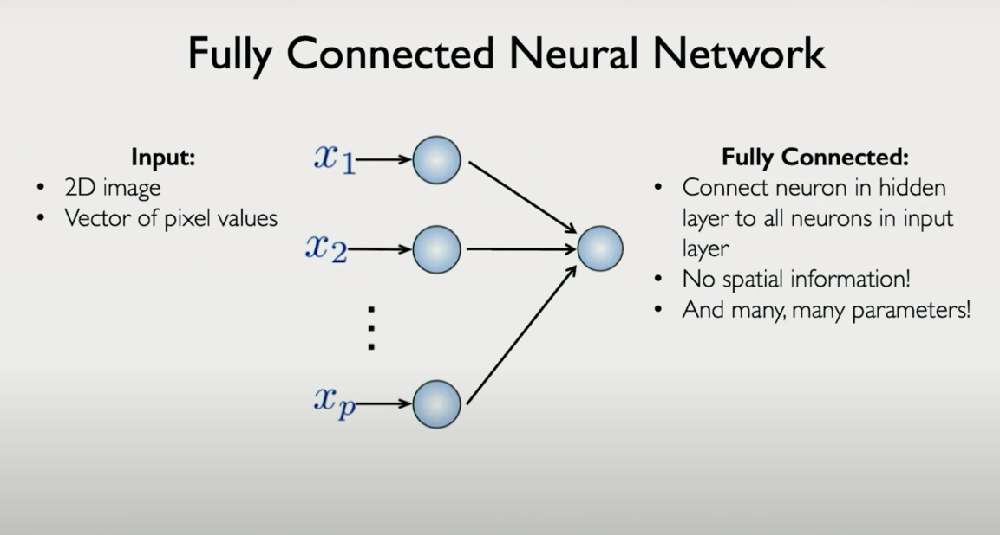
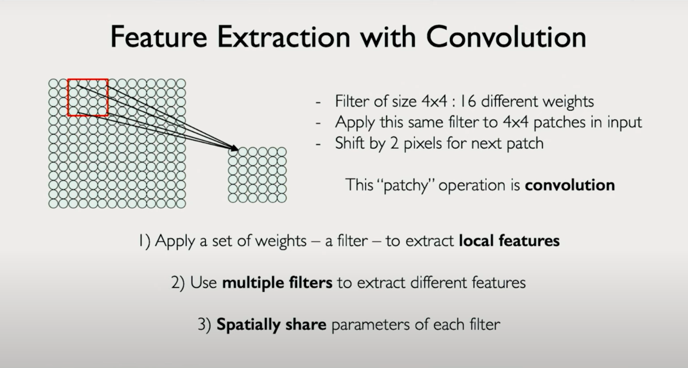
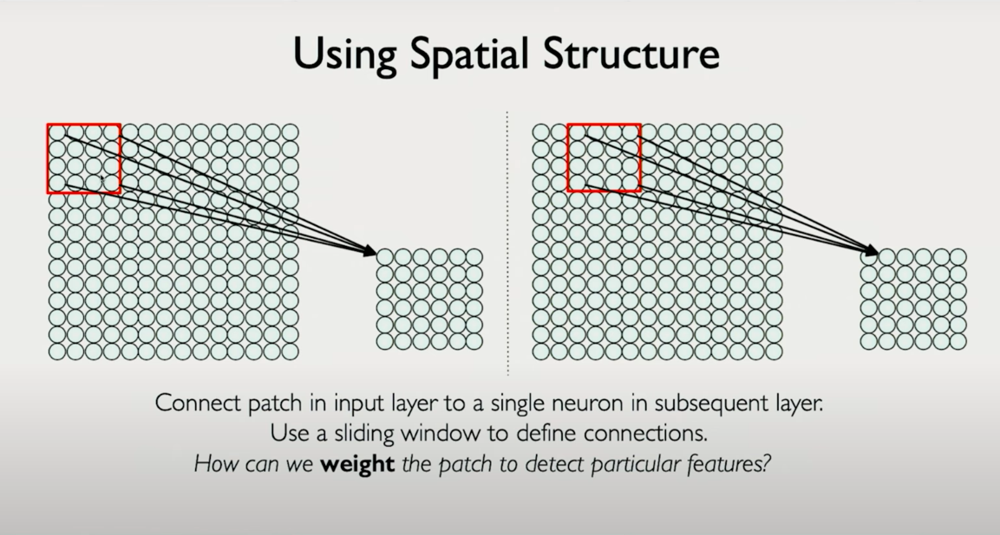
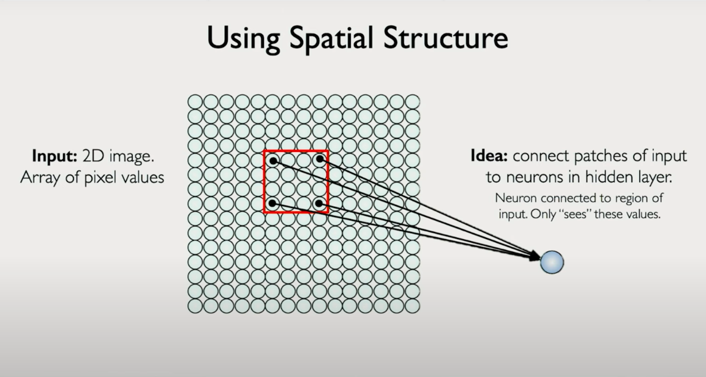

# Chapter 7: Filters, Features, and the Power of Convolutions

## The Feature Detection Power of Convolutions
So far, we’ve learned that:  
Fully connected networks discard spatial structure.  
Convolutions preserve it by operating locally.  
Each filter detects a specific pattern by sliding over the image.  

But how exactly does a filter detect features like edges, textures, or shapes?  
Let’s answer that through an example.

## Detecting Shapes: The Case of an “X”
Suppose you're trying to detect whether an image contains an X — not necessarily centered, possibly rotated or distorted. You could:  
- Compare the input image pixel by pixel with a prototype X (but this fails under deformation),  
- Or, break the image into patches, and search for elemental components of an X:  
  - a forward diagonal  
  - a backward diagonal  
  - a crossing pattern  

Instead of recognizing the full structure all at once, we detect and recombine parts of it.  
These elemental detectors are what filters are for. Each filter is a small matrix (e.g., 3×3) that looks for a basic pattern:  
- A diagonal line  
- A vertical edge  
- A horizontal transition  
- A corner  

These filters are our learned eyes — they decide what to look for in the data.

Here's the Markdown-compatible version of the image content you shared, with LaTeX math and code blocks properly adapted:

---

### **Convolution: Mathematical Recap**

Let’s define the operation formally.
Let:

* $I \in \mathbb{R}^{H \times W}$: Input image (grayscale)
* $F \in \mathbb{R}^{k \times k}$: Filter of size $k \times k$
* $O \in \mathbb{R}^{H \times W}$: Output feature map

Then the convolution operation at location $(i, j)$ is defined as:

$$
O(i, j) = \sum_{m=0}^{k-1} \sum_{n=0}^{k-1} I(i + m, j + n) \cdot F(m, n)
$$

1. This is an element-wise multiplication of the filter and the patch of the image it covers.
2. The result is summed up to a single scalar.
3. We then slide this filter across the image (usually with stride = 1).
4. Optionally, we add a bias and apply a nonlinearity (e.g., ReLU).

This gives us a 2D output — a feature map — indicating where in the image that particular pattern is detected.

---

### **Interpretable Filters and Hand-Engineering**

Before learning filters via backpropagation became common, hand-engineered filters were widely used.
Let’s examine a few examples:

---

### **Edge Detection Filters**

#### Horizontal edge filter (Sobel):

```text
[ -1, -2, -1 ]  
[  0,  0,  0 ]  
[  1,  2,  1 ]
```

#### Vertical edge filter (Sobel):

```text
[ -1,  0,  1 ]  
[ -2,  0,  2 ]  
[ -1,  0,  1 ]
```

---
These filters approximate derivatives — they highlight where pixel intensity changes rapidly. They are high-pass filters, designed to detect edges.
Here is the content from your image converted into clean, Markdown-compatible format with code blocks and proper structure:

---

### **Sharpen Filter:**

```text
[  0, -1,  0 ]  
[ -1,  5, -1 ]  
[  0, -1,  0 ]
```

These emphasize central pixels and subtract neighbors — enhancing contrast and sharpness.
These filters are **interpretable** — you can understand their behavior just by inspection.

---

### **What’s Learned in CNNs?**

In modern CNNs, these filters are **not hand-coded**. Instead:

* They are learned directly from data via backpropagation.
* The model finds the optimal set of filters that maximize task performance (e.g., accuracy).

---

### **Early layers typically learn:**

* Edges
* Corners
* Color blobs

---

### **Deeper layers combine these to form:**

* Parts of objects (e.g., eyes, wheels)
* Full objects (e.g., faces, cats)

Each convolutional filter becomes a template detector for a particular feature.

---

### **Summary of Concepts**

Let’s consolidate what we’ve covered:

| **Concept**           | **Explanation**                                                     |
| --------------------- | ------------------------------------------------------------------- |
| **Filter (Kernel)**   | A small matrix that scans over the image, detecting a feature       |
| **Convolution**       | Element-wise multiplication + summation between filter and patch    |
| **Stride**            | How far the filter moves at each step (e.g., 1 pixel, 2 pixels)     |
| **Padding**           | Adding zeros around the image to preserve spatial dimensions        |
| **Feature map**       | Output after applying a filter across the entire image              |
| **Learnable filters** | CNNs optimize these filters via training to extract useful features |

---
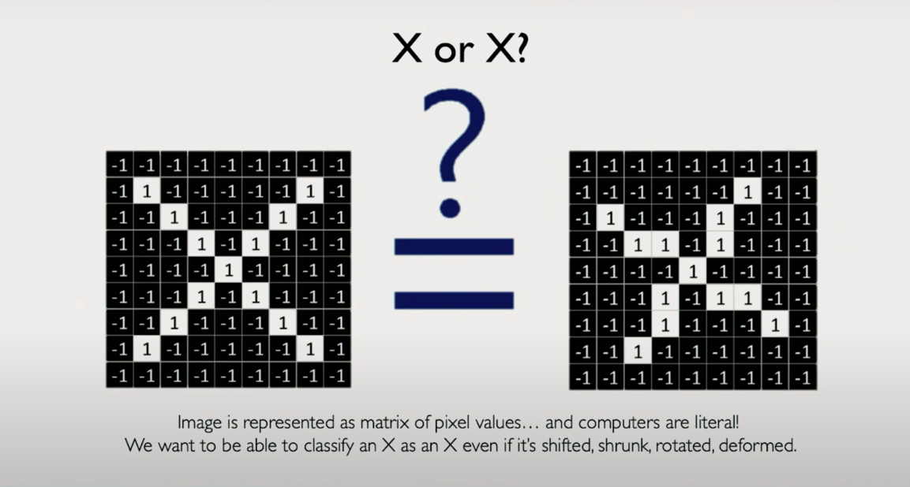
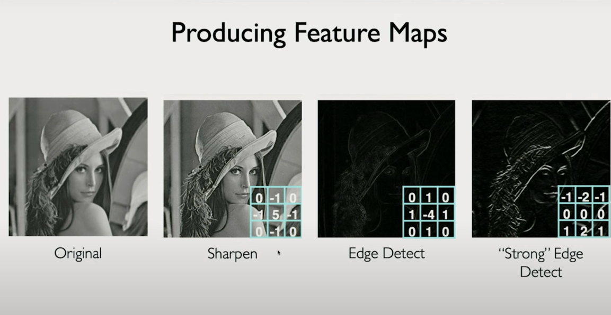
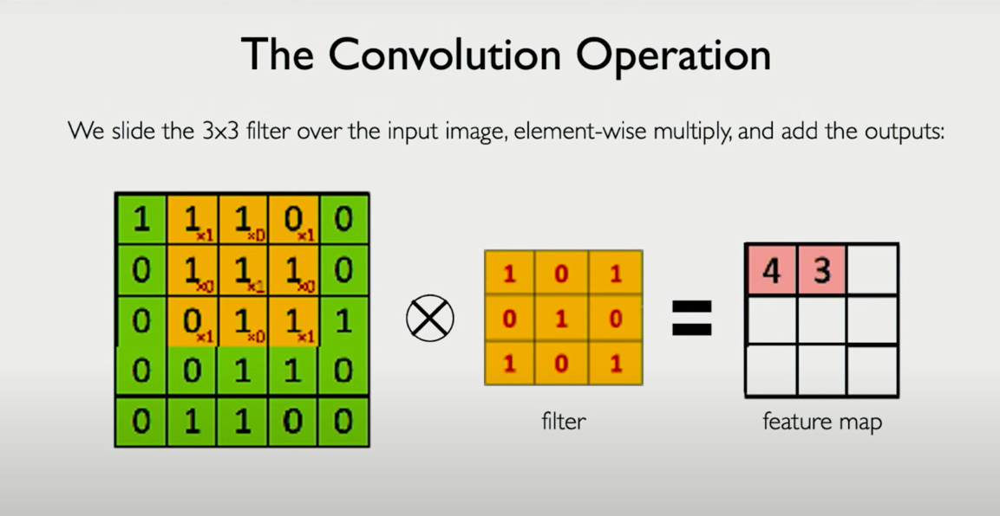
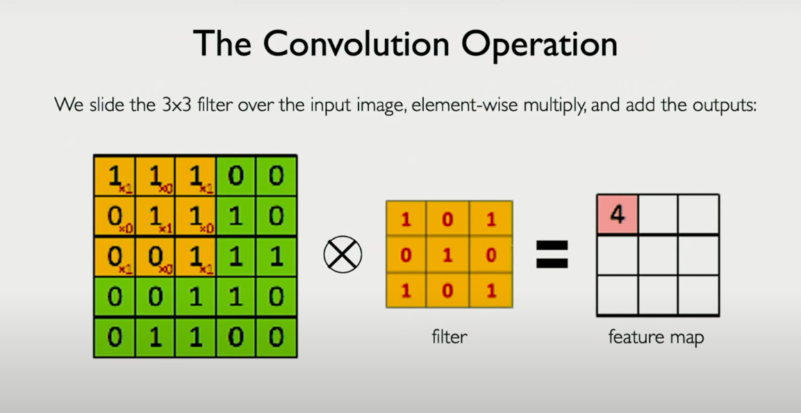
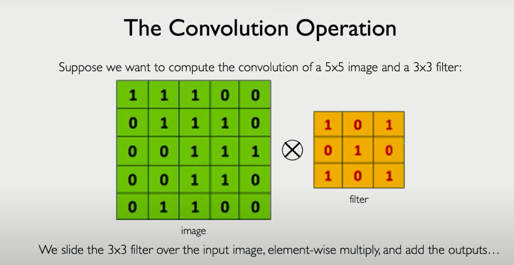
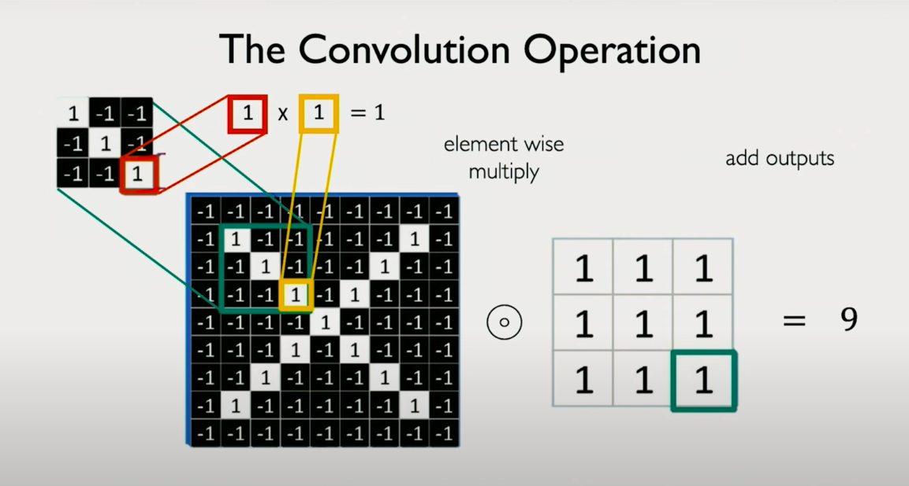
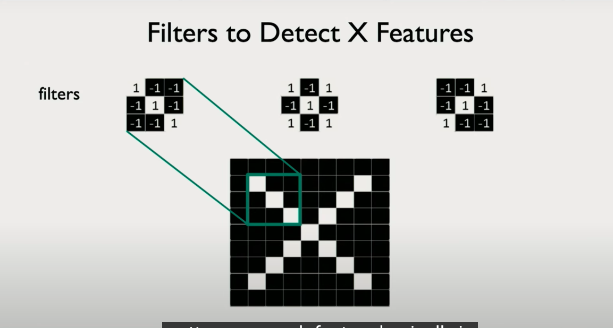
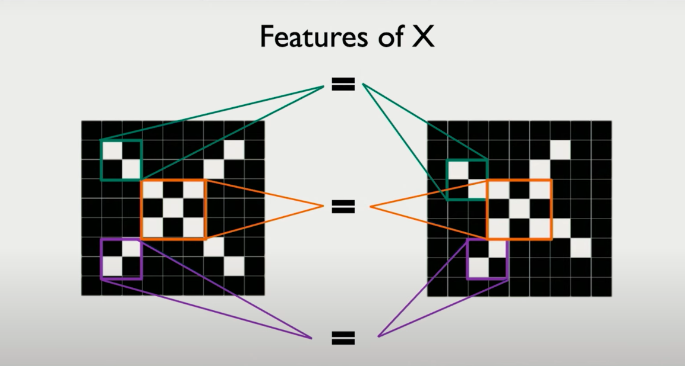

# Chapter 8: "Learning to See: Understanding the Inner Workings of CNNs"

## From Convolution to CNN: Zooming Out

You already know the basic idea:  
- The image is input.  
- The filters (also called kernels) are slid over the image to compute feature maps via convolution.  
- The resulting numbers capture the presence (or absence) of specific patterns (edges, corners, etc.) in the image.  

But so far, we assumed we had those filters. In real CNNs:  
**We learn those filters automatically from data.**

---

## The Core Components of a CNN

There are three core operations you’ll repeatedly see in CNNs:

### (i) Convolution
- Captures local features.  
- Each filter learns to detect a specific pattern (edge, texture, shape).  
- Produces multiple feature maps, each indicating where that pattern appears.

### (ii) ReLU: Nonlinearity (e.g., ReLU) Rectified Linear Unit
- Applies an activation function to the feature map output.  
- ReLU sets all negative values to zero (like a threshold gate).  
- This nonlinearity makes the network expressive, i.e., capable of learning complex, nonlinear patterns.

### (iii) Pooling (Downsampling)
- Reduces the spatial dimensions (e.g., 28×28 → 14×14).  
- Helps reduce computation and introduces invariance to small translations/rotations.  
- Common: **Max pooling**, which retains only the max value in each small window.  
- **Mean Pooling**: averages out the whole matrix and preserves the mean/avg instead of max.

These steps repeat across layers, allowing the network to learn increasingly abstract and complex representations.

---

## Local Connectivity + Hierarchical Features

CNNs exploit local connectivity: each neuron only “sees” a small patch of the image.  
However, by stacking multiple convolution layers, the effective receptive field grows:

- **Layer 1** learns edges (horizontal, vertical, diagonal).  
- **Layer 2** learns combinations of those edges (corners, curves).  
- **Layer 3+** starts recognizing more semantic features (eyes, faces, objects).  

This is **hierarchical feature extraction**, a key power of CNNs.

---

## Multiple Filters per Layer = Feature Volume

Each conv layer learns not one, but many filters—each producing its own feature map.  
Stacking all of these maps together gives a **feature volume** (like a 3D tensor).  

**Example:**  
- Input: (32×32×3) image (RGB)  
- Conv Layer 1 applies 16 filters → Output: (30×30×16)  
- Next conv layer may apply 32 filters → Output: (28×28×32), and so on...  

The **depth increases**, but the **height/width may decrease via pooling**.

---

## Training: How Filters Are Learned

Filters (i.e., weights of the convolution kernels) are learned via **gradient descent**.  
**How?**

1. The network makes a prediction (e.g., "this is a cat").  
2. If it's wrong, a loss is calculated.  
3. The error is back-propagated through the network.  
4. This updates the filters to reduce future error.

So over time, **filters specialize to detect patterns most useful for distinguishing between the target classes**.

---

## Visualizing Filters

After training:  
- First-layer filters tend to look like **oriented edges** (Sobel-like).  
- Deeper filters may detect **textures, motifs, or object parts** (eyes, wheels, ears).  

You can visualize these filters and activations to understand what the model “sees”.  
This is powerful because it gives **interpretable insight** into otherwise “black-box” deep models.

---

## Classification via Softmax

Once you've passed the image through multiple **convolution + ReLU + pooling** layers:  
- You’re left with abstract high-level features.  
- **Flatten** them and feed them into a fully connected (dense) layer.  
- The final layer uses **Softmax** to produce a probability distribution over possible classes.
Here is your image content converted into clean, Markdown-compatible format with LaTeX and code blocks preserved:

---

### **Softmax formula:**

```math
\text{Softmax}(z_i) = \frac{e^{z_i}}{\sum_{j=1}^{K} e^{z_j}}
```

**Where:**

* $z_i$ is the score for class $i$
* $K$ is the total number of classes

---

### **This ensures:**

* Each output is in $[0, 1]$
* All outputs sum to 1 (so they form a valid probability distribution)

---

### **Overall Pipeline: CNN for Classification**

```text
Input Image
      ↓
Convolution Layer(s) ➜ ReLU ➜ Pooling
      ↓
More Conv Layers ➜ ReLU ➜ Pooling
      ↓
Flatten
      ↓
Fully Connected Layer
      ↓
Softmax
      ↓
Predicted Class Probabilities
```

The CNN learns to extract patterns that are invariant, informative, and interpretable, and then uses those to classify the input.

---

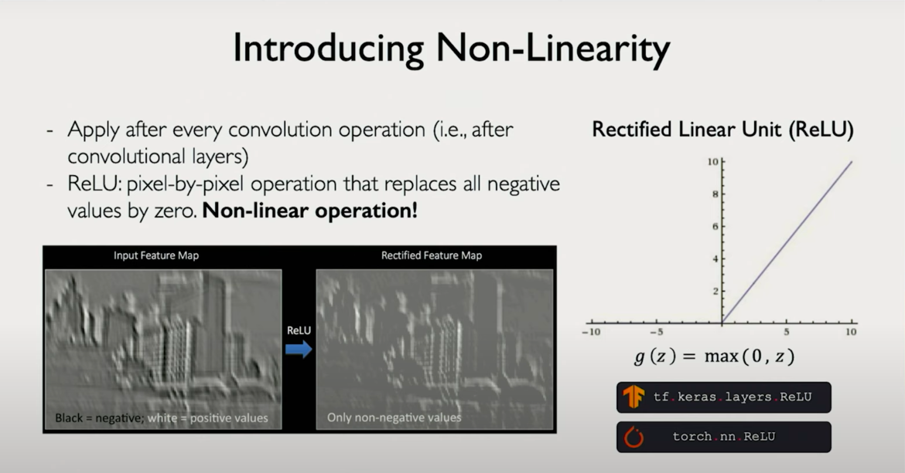
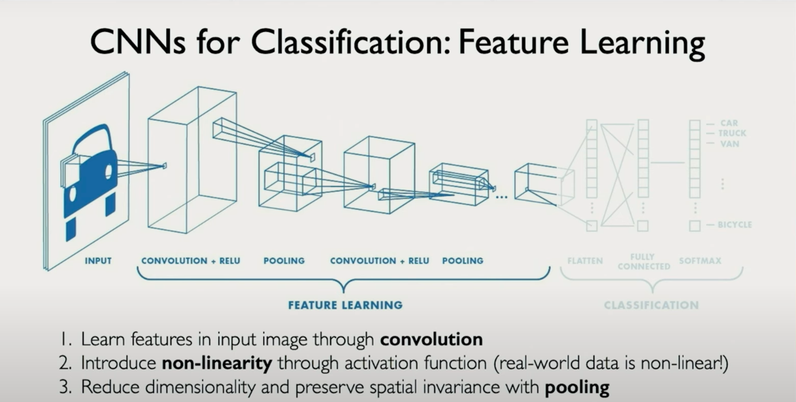
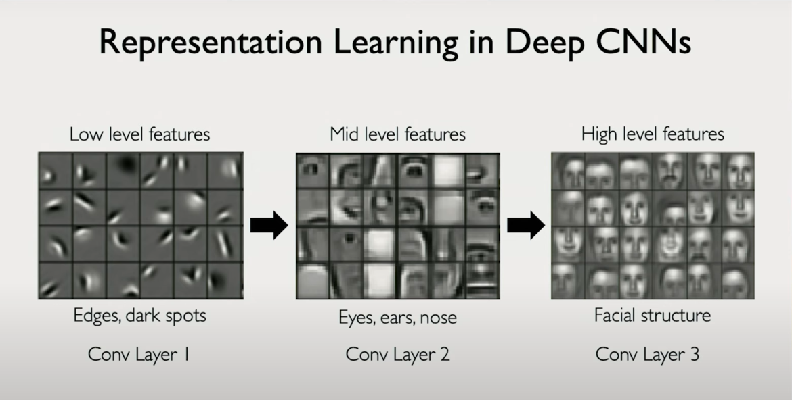
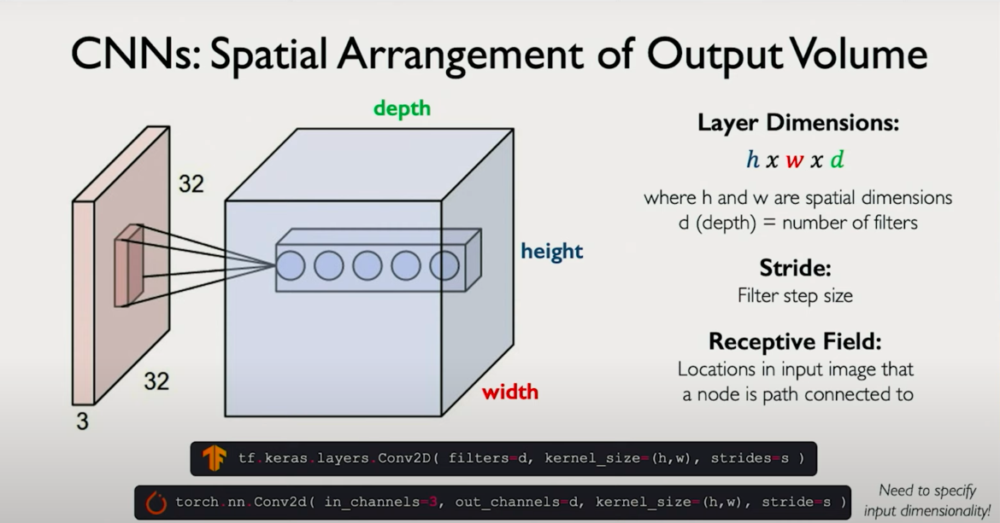

# Chapter 9: Building an End-to-End Convolutional Neural Network

In this chapter, we’ll walk through the process of building a complete convolutional neural network (CNN) from the ground up. The focus will be on understanding both the conceptual architecture and its concrete implementation in PyTorch. Our final objective is to classify images (e.g., digits 0–9) by learning hierarchical visual features directly from raw pixel inputs.

This is not a theoretical detour. Everything we explore here is driven toward the practical goal of building a trainable, end-to-end system that can extract features, flatten them into an abstract representation, and make predictions over a predefined set of categories.

## Architectural Breakdown: Two Key Stages

A CNN is organized into two principal stages:

### 1. Feature Extraction

This is where convolutional operations take place. The model scans over the input image using learnable filters (also called kernels), extracting local patterns such as edges, corners, and textures. These filters are not manually specified they are learned from the data.  
We begin with:

- A first convolutional layer that applies 32 filters to the input. The output is a 3D volume of shape (32, H, W) one activation map per filter.

- A ReLU nonlinearity to introduce the non-linear decision-making capability.

- A max pooling operation to downsample the spatial resolution, allowing the network to focus on what was detected rather than where it was detected.

Then:

- A second convolutional layer that builds on the first by learning 64 additional filters. These filters now operate over the 32-feature volume from the first layer.

- Followed again by ReLU and pooling.

This pipeline lets us learn a rich, hierarchical set of features — from edges to textures to object parts.

### 2. Classification (Fully Connected Layers)

Once spatial features have been extracted, we transition from spatial reasoning to semantic reasoning.  
- The multi-channel feature maps from the last convolutional layer are flattened into a single vector.

- This vector is then passed through fully connected (dense) layers.

- Finally, a softmax function squashes the final output into a probability distribution over the target classes (e.g., digits 0 to 9).

This structure forms a classic CNN pipeline:  
**convolutions → pooling → flattening → classification**

## Implementation in PyTorch  
Below is the code that mirrors the above architecture using PyTorch's nn.Module API.

```
import torch
import torch.nn as nn
import torch.nn.functional as F

class ConvNet(nn.Module):
    def __init__(self, num_classes=10):
        super(ConvNet, self).__init__()
        
        # Feature extractor
        self.features = nn.Sequential(
            nn.Conv2d(in_channels=1, out_channels=32, kernel_size=3, padding=1),  # 1x28x28 → 32x28x28
            nn.ReLU(),
            nn.MaxPool2d(kernel_size=2, stride=2),
            # 32x28x28 → 32x14x14
            
            nn.Conv2d(in_channels=32, out_channels=64, kernel_size=3, padding=1),  # 32x14x14 → 64x14x14
            nn.ReLU(),
            nn.MaxPool2d(kernel_size=2, stride=2)
            # 64x14x14 → 64x7x7
        )
        
        # Classifier
        self.classifier = nn.Sequential(
            nn.Flatten(),                    # 64x7x7 → 3136
            nn.Linear(64 * 7 * 7, 128),
            nn.ReLU(),
            nn.Linear(128, num_classes)      # Output: 10
        )
    
    def forward(self, x):
        x = self.features(x)
        x = self.classifier(x)
        return x  # Output: logits (apply softmax externally if needed)
```

### **Key Design Intuitions**

* **Why 32 and 64 filters?**
  These are design choices balancing performance and computational efficiency. 32 filters in the first layer are often sufficient to capture basic spatial patterns. 64 filters in the second layer expand the representational capacity without exploding model size.

* **Why ReLU?**
  ReLU introduces non-linearity in a simple and computationally efficient way. It also helps mitigate the vanishing gradient problem compared to older activations like sigmoid or tanh.

* **Why Pooling?**
  Max pooling reduces spatial dimensions, improving generalization and reducing the number of parameters. It also gives the model some translation invariance.

* **Why Flatten?**
  We shift from 2D spatial reasoning to 1D semantic classification. This transformation is necessary to connect convolutional outputs with fully connected layers.

---

### **Final Remarks**

This CNN does not just “look” at pixels it learns a sequence of increasingly abstract features, layer by layer. Crucially, all of these filters are learned directly through backpropagation and optimization using labeled training data.

By separating the feature extraction from classification — but training them jointly CNNs combine the strengths of both automatic representation learning and supervised learning.

---
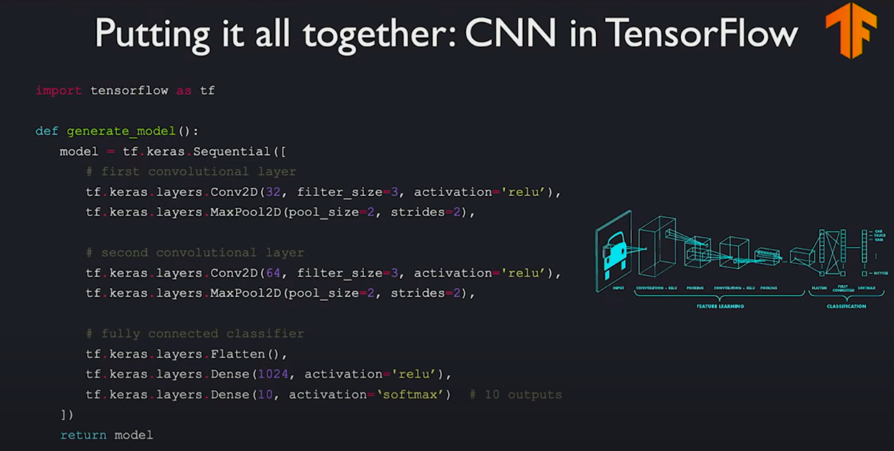
# Chapter: 10 Extending CNNs Beyond Classification

## Intuition Behind CNN Architecture Choices

Choosing CNN architecture parameters — like patch size, feature dimensions, and layer depth is more of an art guided by intuition and data characteristics than a strict science. For example, using a 3x3 kernel may be appropriate when features are expected to be fine-grained, but this depends heavily on the scale and resolution of the input. For large images, such small patches may not be sufficient to capture meaningful spatial context early in the network. Conversely, for smaller images or those with compact features, even a 3x3 patch may hold significant signal. Always consider the visual semantics your model needs to learn and at what resolution those features are most meaningful.  
Another important consideration is invariance. If your model is trained on only upright faces, it will likely fail on rotated ones unless rotation is part of your training distribution. The model does not generalize rotationally unless explicitly trained to do so.

## From Classification to Detection and Beyond

CNNs were initially popularized for image classification tasks, but the architecture is flexible and modular. At its core, a CNN can be split into two components: a feature extractor and a task-specific head. The task-specific head can be adapted for a wide range of applications beyond classification, including detection, segmentation, and control.

### 1. Classification

At the most basic level, the CNN extracts features and maps them to class probabilities. For example, a medical imaging CNN might output a binary label indicating the presence or absence of a condition like cancer from a mammogram. The last few layers are usually a flattening operation followed by fully connected layers and a softmax or sigmoid for classification.

### 2. Object Detection

Object detection builds on classification by not only identifying what is in an image but also where. Instead of predicting just a class label, the network must output:

- The object class  
- A bounding box around the object  
- Potentially multiple such predictions per image  

This increases complexity significantly, because:  

- Objects can appear anywhere in the image  
- They can vary in size and shape  
- The number of objects is not fixed  

A naive approach would involve placing thousands of boxes of different sizes at different locations and classifying each independently, but this is computationally infeasible.

### 3. Region-Based CNNs (R-CNNs)

To address the inefficiency of naive detection, region-based CNNs were proposed. These models integrate regional proposal into the architecture itself. The Region Proposal Network (RPN) learns to identify parts of the image that are likely to contain objects. These regions are then passed through a shared feature extractor and classifier. This tight integration means the entire pipeline can be trained end-to-end using shared learned features. It is faster and more accurate than separate proposal and classification models.

### 4. Semantic Segmentation

Going beyond object detection, segmentation requires a per-pixel classification. For each pixel in the input image, the model outputs a class label (e.g., road, sky, person). Unlike classification, where we reduce the spatial dimensions, segmentation requires maintaining spatial resolution. This is often done by:

- Using convolutions and pooling to extract features (downsampling)  
- Then using upsampling or transposed convolutions to bring the output back to the input resolution  

The output is an image-sized tensor where each pixel has a predicted class.

### 5. Control Models for Autonomous Navigation

CNNs can also be used in control tasks, such as autonomous driving. In this setup, inputs might include:

- Camera images (first-person perspective)  
- Top-down or map-view representations  

The network outputs are not discrete classes but continuous control signals, such as steering angles. Rather than classifying into fixed buckets, the model learns a distribution over continuous outputs effectively turning the classification head into a regression or probabilistic model.  
These models can learn directly from driving data, inferring high-level representations that allow the system to drive in unseen environments. Unlike traditional autonomous driving stacks that require prior human-mapped routes, these models generalize to new cities using just visual input and map guidance.

## Summary and Broader Impact

CNNs are foundational, but their power lies in modularity. Once feature extraction is decoupled from task-specific heads, the same architecture can be adapted for:

- Medical diagnosis  
- Object detection in autonomous systems  
- Scene understanding via segmentation  
- Robotic control and navigation  

While each task introduces specific architectural modifications, they all stem from the same core ideas: learning spatial features via convolution and applying supervision at the appropriate resolution and form — whether classification, bounding boxes, pixel masks, or control signals.
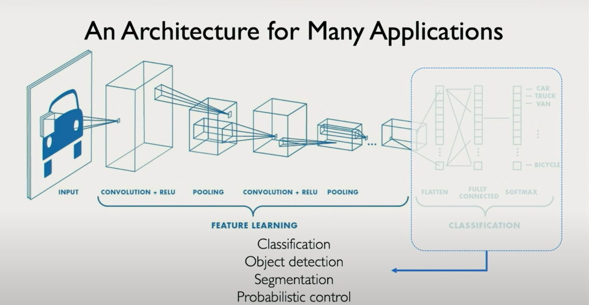
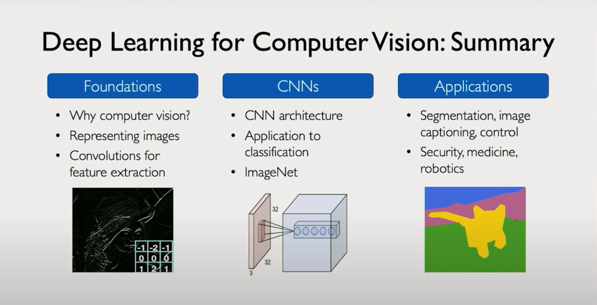
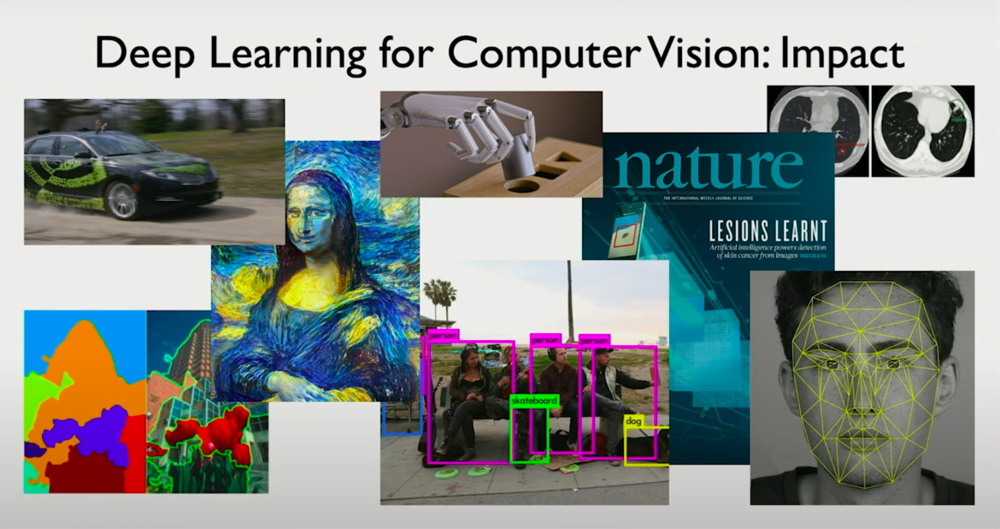
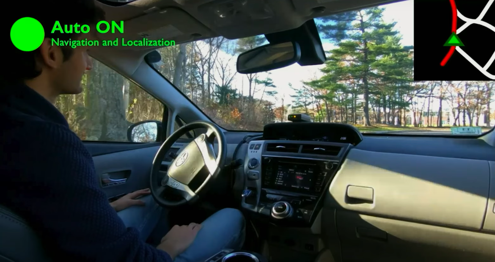
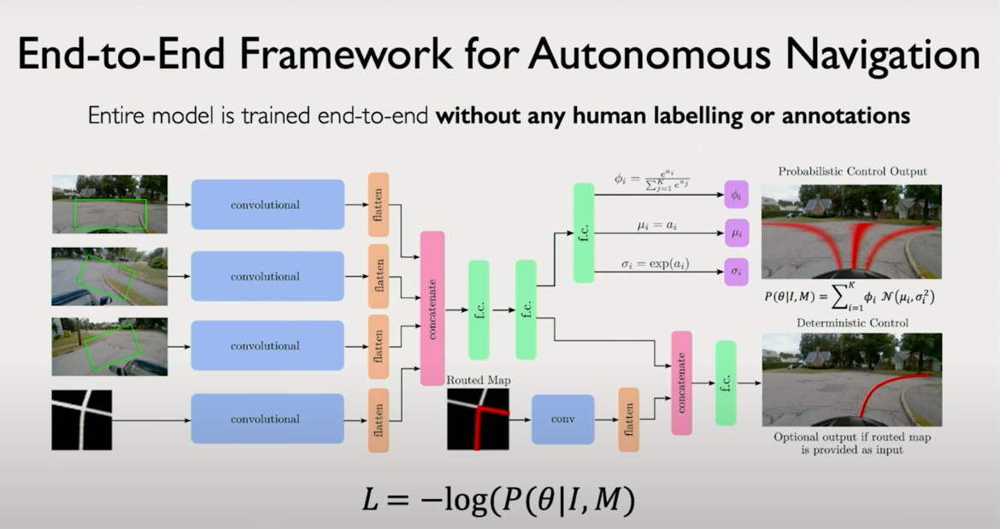
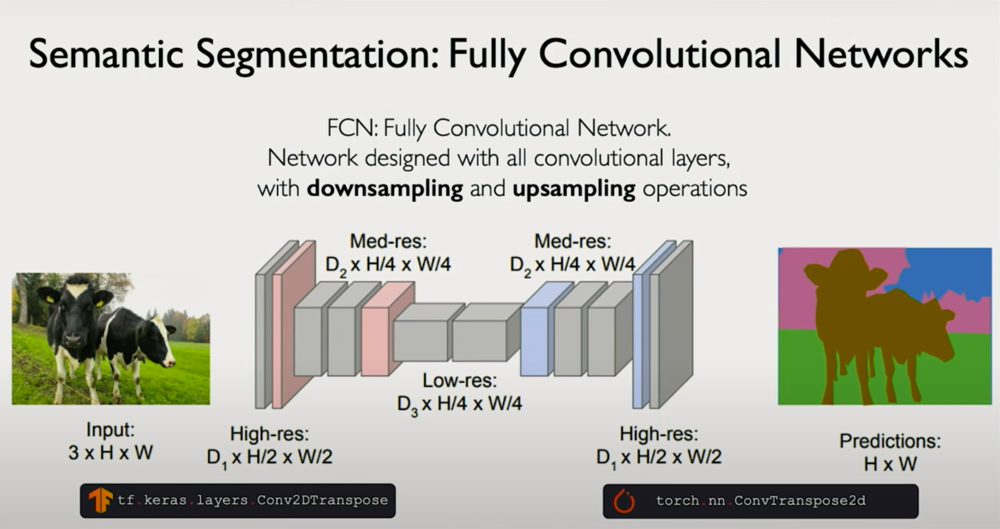
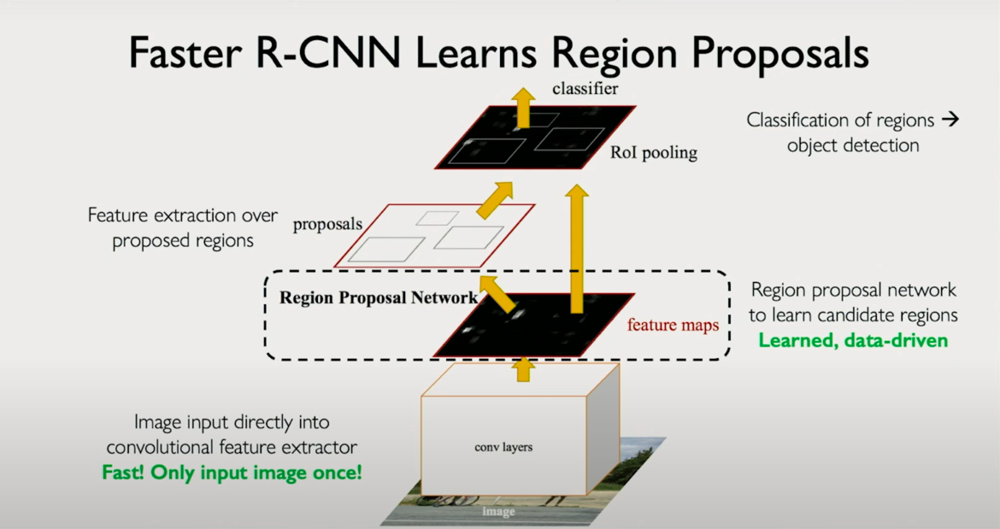
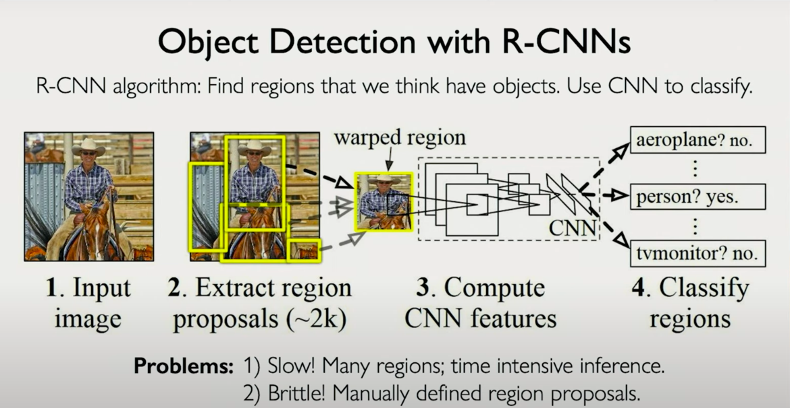
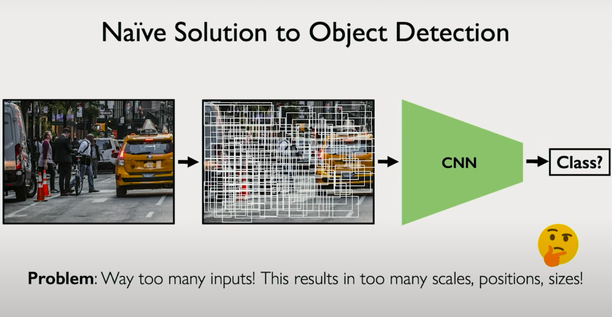
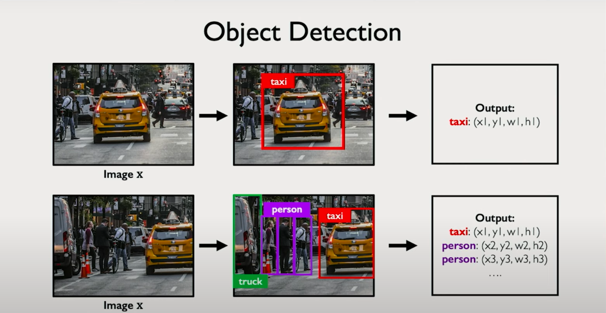
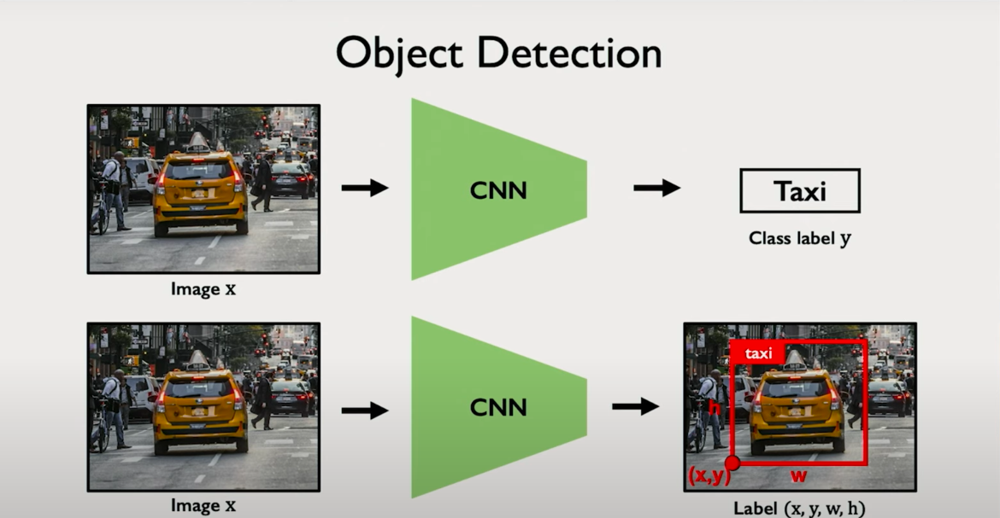
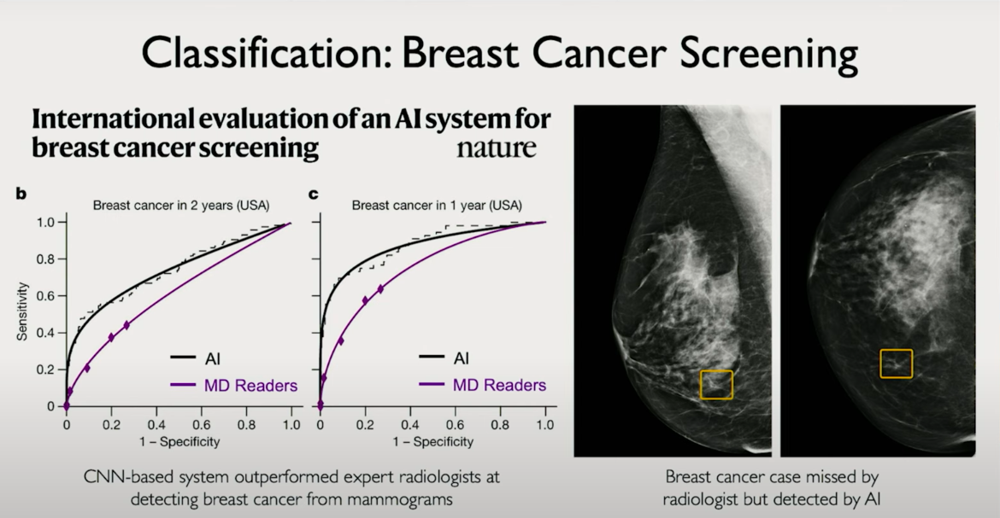
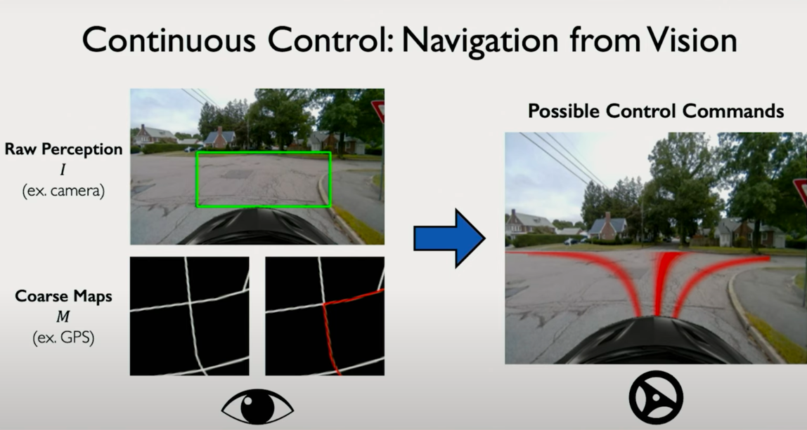
