# Deep Sequence Modelling and Recurrent Neural Networks (RNNs)

## Chapter 1: Foundations of Deep Sequence Modeling

## Why Sequence Modeling? A Motivating Example

Let’s begin with an intuitive motivation. Imagine a ball moving in 2D space. You're asked to predict its next location.  
**Case 1:**  
You only have access to the ball's current position. Any prediction you make will essentially be a guess — the problem is underdetermined.

**Case 2:**  
You're also given the ball’s prior trajectory — its historical positions. With this sequence of past states, you can now model its motion and reasonably estimate its future position.

This illustrates the crux of sequence modeling: incorporating historical context to improve predictive accuracy.

## Sequence Data in the Real World

While the example above is simple, the relevance of sequence modeling extends across diverse domains:

- **Speech and Audio:**  
  Voice signals can be decomposed into sequences of sound wave chunks over time.

- **Natural Language:**  
  Sentences are sequences of words or characters.

- **Medical Signals:**  
  ECGs and EEGs are temporal sequences of voltage measurements.

- **Finance:**  
  Stock prices and market indicators evolve as time-series data.

- **Biology:**  
  DNA and protein sequences are naturally sequential.

- **Video:**  
  Frame-by-frame temporal evolution can be modeled as sequences.

- **Weather Forecasting:**  
  Historical weather patterns provide sequential structure for future prediction.

In each case, the temporal or positional ordering of data points is essential. Ignoring that order risks discarding key patterns.

## Types of Sequence Modeling Problems

Unlike traditional classification tasks where inputs and outputs are fixed-length and often tabular, sequence modeling introduces structured and variable-length data. Let's look at some canonical problem types:

### Sequence Classification:
- **Input:** A sequence of tokens (e.g., words in a sentence)  
- **Output:** A fixed label (e.g., sentiment classification: positive vs negative)  
- **Example:** Text classification, intent recognition.

### Sequence-to-Sequence (Seq2Seq) Generation:
- **Input:** A sequence  
- **Output:** Another sequence  
- **Examples:**  
  - Translation: English → French  
  - Speech Recognition: Audio → Text  
  - Image Captioning: Visual features → Sentence

### Many-to-One:
- **Input:** A sequence  
- **Output:** A single label  
- **Example:** Predicting stock trend direction based on previous N time steps.

### One-to-Many:
- **Input:** A single state  
- **Output:** A sequence  
- **Example:** Image → Description (caption generation).

### Many-to-Many:
- **Input:** Sequence A  
- **Output:** Sequence B  
- **Example:**  
  - Video frame → Text transcript  
  - Language translation tasks

These problem types are foundational to real-world applications of NLP, speech, vision, and decision modeling systems.

## Core Challenge: Capturing Temporal Dependencies

A feedforward neural network  as discussed in the previous lecture  assumes that all input features are independent and identically distributed (i.i.d.). This assumption breaks down in sequential settings. In sequence modeling:

- Inputs are ordered.  
- Future predictions must respect and leverage past observations.  
- The same model must be applied across time steps or positions.

To handle this, we need architectures that are designed to process sequences  capable of learning representations where current predictions are functions of both present and past information.

This sets the stage for understanding Recurrent Neural Networks (RNNs), Long Short-Term Memory (LSTM) networks, and eventually, Transformers.
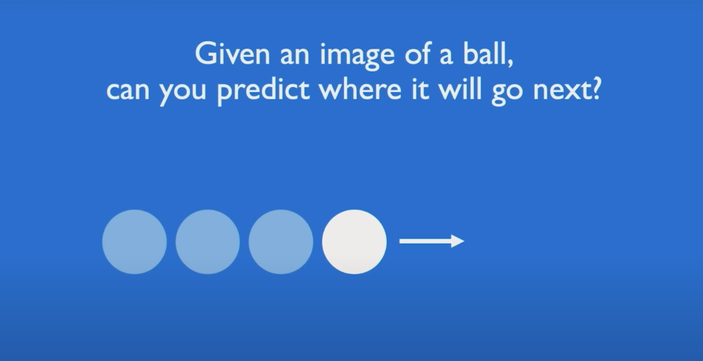
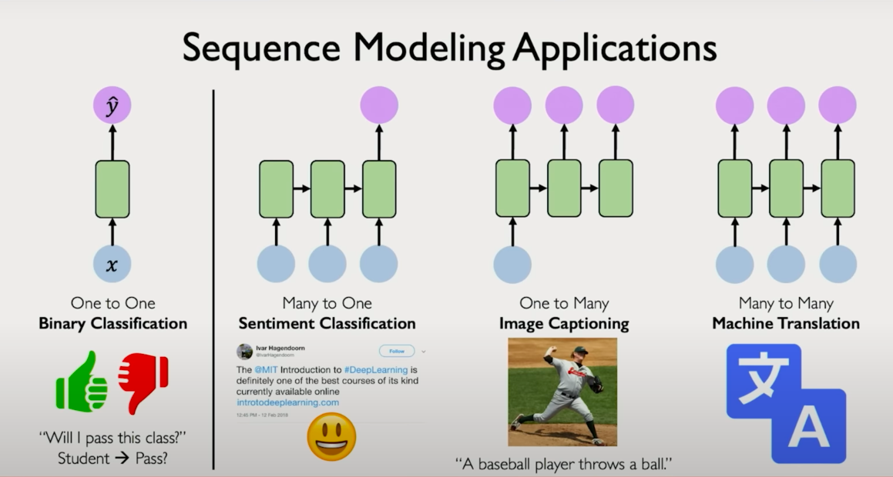

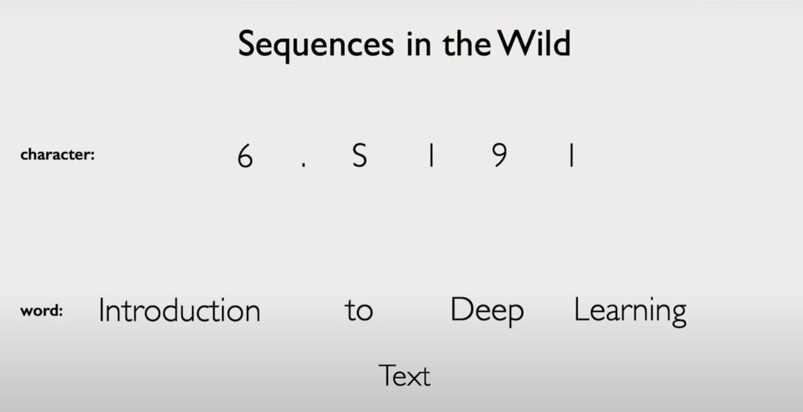
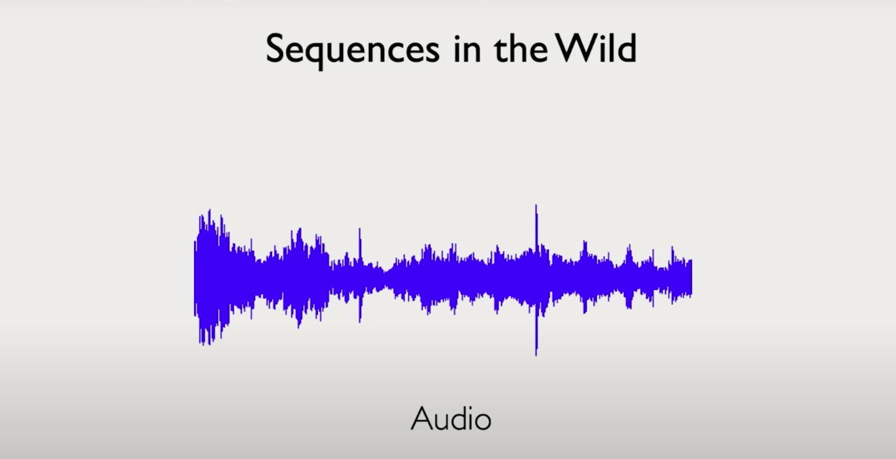

# Chapter :2 2.7 From Static Networks to Time-Aware Models

In the previous section, we established the importance of modeling sequential dependencies. We now turn to how the field historically addressed this problem, beginning with a shift from traditional feedforward architectures to networks capable of handling temporal dynamics.

## Revisiting the Perceptron

Let us return briefly to the basic building block introduced in Lecture 1: the perceptron. Each perceptron takes a vector of inputs $$\( x_1, x_2, \dots, x_m \)$$, applies a weighted sum, and passes the result through a non-linear activation function to produce an output $$\( \hat{y} \)$$. This output can then feed into further layers to construct deep networks.  
In its basic form, the perceptron operates on a fixed-length vector with no awareness of any sequential structure. All inputs are assumed to belong to a single time slice. There is no notion of temporal ordering or dependence on previous data points. This limitation makes such architectures insufficient for handling sequential data.

## Applying Feedforward Networks to Time Series: A Naive Attempt

One naive way to apply a static neural network to sequence data is to treat each time step independently. Imagine rotating our input-output diagram vertically, where each input      $$\( x_t \)$$ is processed by the same network $$\( f \)$$ to yield an output$$\( \hat{y}_t \)$$. We repeat this process across all time steps $$\( t = 0, 1, 2, \dots \)$$

While this allows us to handle sequences of inputs, each prediction $$\( \hat{y}_t \)$$ is based only on the corresponding $$\( x_t \)$$. There is no memory of what happened at earlier time steps. This independence assumption contradicts the very premise of sequential modeling, which relies on the idea that prior context informs future states.  
This setup lacks the ability to model dependencies across time. For example, if you are predicting a word in a sentence, the words that came before are crucial to predicting the next one. Ignoring previous steps leads to poor modeling capacity in such domains.

## Introducing Recurrence: Capturing Temporal Dependencies

To solve this problem, we introduce a core idea: maintain and update an internal state as the network processes each time step.
To solve this problem, we introduce a core idea: maintain and update an internal state as the network processes each time step. Let us define this hidden or internal state as $$\( h_t \)$$. At each time step $$\( t \)$$, we compute:

- An updated internal state $$\( h_t \)$$, which is a function of both the current input $$\( x_t \)$$ and the previous state $$\( h_{t-1} \)$$.
- An output prediction $$\( \hat{y}_t \)$$, which now depends on $$\( h_t \)$$ rather than directly on $$\( x_t \)$$ alone.

**Formally:**

$$\[
h_t = f(x_t, h_{t-1}) \quad \hat{y}_t = g(h_t)
\]$$


This setup provides a recurrence relation. The internal state acts as a form of memory, encoding information from past inputs and making it available to influence future computations. Crucially, this creates a dependency chain over time. The prediction at time step $$\( t \)$$ indirectly depends on all inputs $$\( x_0, x_1, \dots, x_t \)$$ seen so far.

This structure defines a Recurrent Neural Network (RNN).

## Visualizing Recurrence

There are two primary ways to visualize an RNN:

1. **Unrolled View:**  
   We unroll the recurrence over time. Each time step is shown as a separate copy of the same neural unit, connected to the previous and next states via the hidden variable \( h \). This view is useful for understanding backpropagation through time and dependencies between states.

2. **Cyclic View:**  
   We represent the recurrent computation as a loop in the computational graph. This succinctly captures the feedback nature of the model: the hidden state feeds back into itself over time.

Both views are functionally equivalent but offer different insights. The unrolled view emphasizes temporal flow. The cyclic view emphasizes structural recurrence.

## Why This Matters

The introduction of recurrence was a turning point in sequence modeling. It allowed neural networks to:

- Learn patterns that span across multiple time steps.  
- Maintain a form of short-term memory.  
- Generalize across sequences of different lengths using a shared set of parameters.
Although vanilla RNNs are limited in their ability to capture long-term dependencies due to issues like vanishing gradients, they laid the foundation for more advanced architectures such as LSTMs, GRUs, and eventually Transformers.  
This transition from static to dynamic, time-aware models marked the beginning of deep learning's foray into language, speech, and many other sequence-intensive domains.
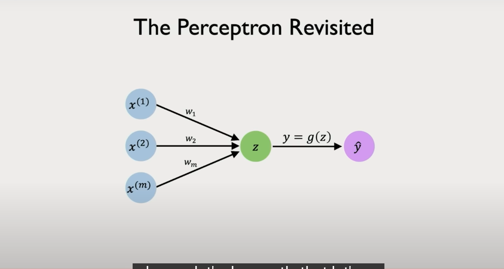
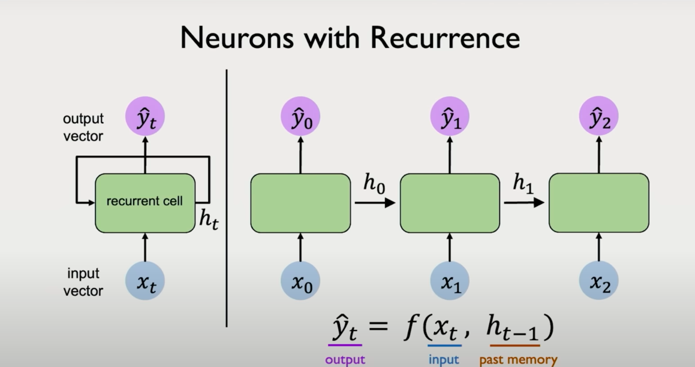
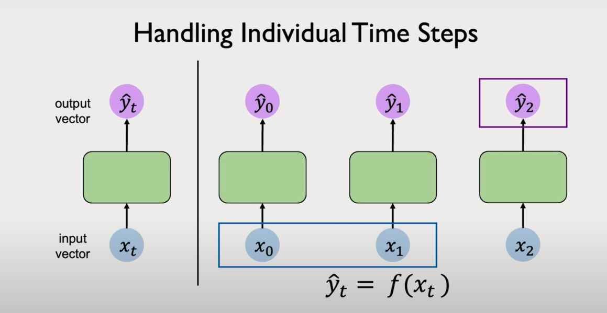
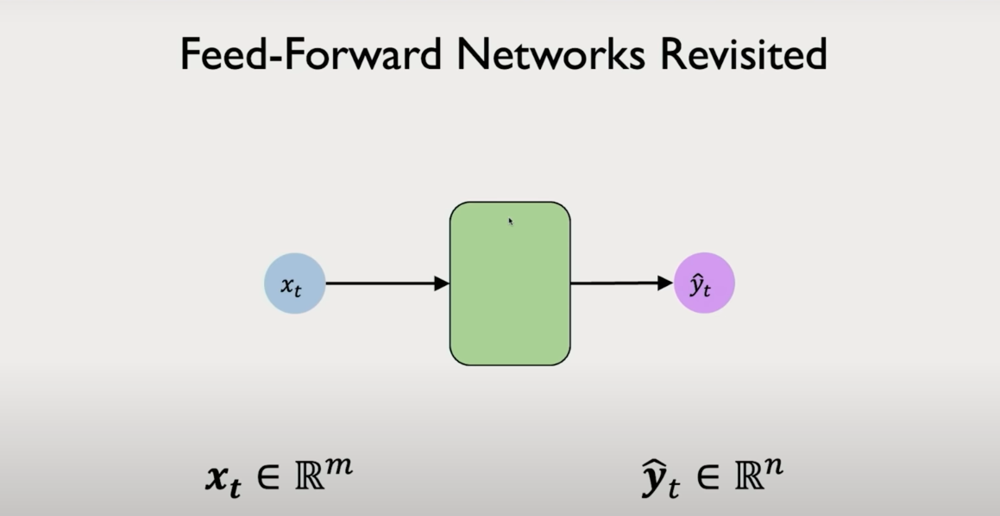
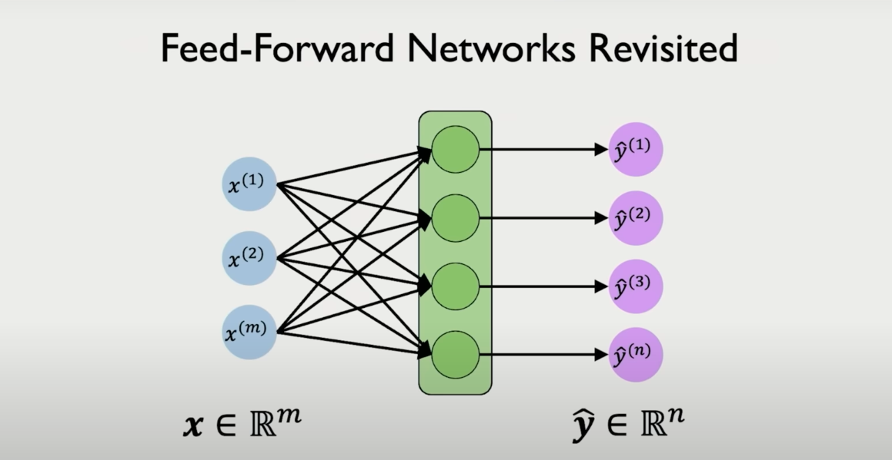

# Chapter 3: Recurrent Neural Networks: Internal Mechanics and Formal Structure

Now that we have an intuitive foundation for recurrent neural networks (RNNs), let us formalize their internal structure and operational semantics. This section builds upon our understanding of the perceptron, the idea of recurrence, and the motivation behind modeling sequences through memory-aware architectures.

## Recurrence Relations in RNNs

At the heart of an RNN lies the internal state $$\( h_t \)$$, which is updated as the network processes the input sequence step by step. The update to this state is defined by a recurrence relation, which incorporates both the current input $$\( x_t \)$$ and the prior hidden state $$\( h_{t-1} \)$$. This recurrence relation enables the model to retain and evolve a memory of the sequence it has observed so far.  
The state update can be formally described as:

$$\[
h_t = W_{xh} x_t + W_{hh} h_{t-1} + b_h
\]  
\[
y_t = W_{hy} h_t + b_y
\]$$

Here:

- $$\( W_{xh} \)$$: weight matrix mapping input to hidden state  
- $$\( W_{hh} \)$$: recurrent weight matrix mapping previous state to current state  
- $$\( W_{hy} \)$$: output weight matrix mapping hidden state to predicted output  
- $$\( \sigma \)$$: element-wise nonlinearity (e.g., tanh or ReLU)  
- $$\( b_h, b_y \)$$: bias terms  

These same weight matrices are shared across all time steps, which enforces temporal consistency and greatly reduces the number of trainable parameters.

## RNN Logic Through Pseudocode

To further solidify this idea, consider a simple pseudocode example that illustrates how an RNN operates over a sequence:
Here is the pseudocode from the image converted into Markdown format:

<pre><code># Initialize RNN hidden state
h = 0

# Input sequence of words
sentence = ["I", "love", "recurrent", "neural"]

# RNN loop over time
for word in sentence:
    h = update_hidden_state(x=word, h_prev=h)
    y_hat = predict_output(h)
</code></pre>

In this code snippet, each word in the input sequence is processed one at a time. The RNN uses the current word and the previously computed hidden state to compute a new hidden state. This new state is then used to produce an output prediction. The process is iterative and maintains a memory of the sequence through the hidden state updates.

## Unrolled Representation and Weight Sharing

We can visualize the RNN in two complementary ways:

1. **Cyclic Form**: A looped computation graph where the hidden state is fed back into itself.  
2. **Unrolled Form**: A sequence of computations unwrapped across time, where the same operations are applied repeatedly at each time step.

In the unrolled representation:

- The input sequence $$\( x_1, x_2, \dots, x_T \)$$ flows across time steps.  
- The hidden state $$\( h_t \)$$ at each time is passed forward.  
- The output $$\( \hat{y}_t \)$$ is generated at each step.

The same parameters $$\( W_{xh}, W_{hh}, W_{hy} \)$$ are used at every time step. This weight sharing is crucial, as it allows the model to generalize across variable-length sequences while maintaining a manageable parameter count.

## Defining Loss Over Time

Training an RNN requires defining a loss function that quantifies the error between predicted and actual outputs. Unlike static models, where a single loss is computed, RNNs compute a loss at each time step. The total loss across a sequence is then the sum of the losses at individual steps:

$$\[
L_{\text{total}} = \sum_{t=1}^{T} L(\hat{y}_t, y_t)
\]$$

This loss drives the learning process through Backpropagation Through Time (BPTT), where gradients are computed not only over network layers but also across time steps.

## Implementation in Code

Let us now translate this conceptual understanding into a more explicit code-level implementation.  
Consider defining an RNN from scratch using an object-oriented approach:

```python
class SimpleRNN:
    def __init__(self, input_dim, hidden_dim, output_dim):
        self.W_xh = initialize_weights(input_dim, hidden_dim)
        self.W_hh = initialize_weights(hidden_dim, hidden_dim)
        self.W_hy = initialize_weights(hidden_dim, output_dim)
        self.b_h = initialize_bias(hidden_dim)
        self.b_y = initialize_bias(output_dim)

    def forward(self, input_sequence):
        h = np.zeros(self.hidden_dim)
        outputs = []
        for x_t in input_sequence:
            h = activation(np.dot(x_t, self.W_xh) + np.dot(h, self.W_hh) + self.b_h)
            y_hat = np.dot(h, self.W_hy) + self.b_y
            outputs.append(y_hat)
        return outputs

Here is the Markdown version of the content from the image:

````markdown
## Implementation in Code

Let us now translate this conceptual understanding into a more explicit code-level implementation.  
Consider defining an RNN from scratch using an object-oriented approach:

```python
class SimpleRNN:
    def __init__(self, input_dim, hidden_dim, output_dim):
        self.W_xh = initialize_weights(input_dim, hidden_dim)
        self.W_hh = initialize_weights(hidden_dim, hidden_dim)
        self.W_hy = initialize_weights(hidden_dim, output_dim)
        self.b_h = initialize_bias(hidden_dim)
        self.b_y = initialize_bias(output_dim)

    def forward(self, input_sequence):
        h = np.zeros(self.hidden_dim)
        outputs = []
        for x_t in input_sequence:
            h = activation(np.dot(x_t, self.W_xh) + np.dot(h, self.W_hh) + self.b_h)
            y_hat = np.dot(h, self.W_hy) + self.b_y
            outputs.append(y_hat)
        return outputs
````

### This class encapsulates:

* Initialization of weights and biases
* Forward pass through the sequence, updating hidden states
* Prediction generation at each step

This procedural design closely mirrors the theoretical recurrence structure discussed earlier.
It also forms the basis for understanding more complex implementations in TensorFlow or PyTorch.

## From Scratch to Frameworks

Once you understand the fundamentals of how an RNN functions internally, you can transition to using high-level abstractions in frameworks such as TensorFlow and PyTorch. Both offer RNN modules and layers that encapsulate the forward pass, weight sharing, and even support for batching and sequence padding.  
You will practice this in the upcoming lab, where you will implement RNNs for next-word prediction, character generation, and many-to-many sequence classification tasks.

## Applications and Broader Impact

Understanding and building RNNs from scratch equips you to solve a wide range of sequence modeling problems:

- **Many-to-one**: Sentiment classification from a sequence of words  
- **One-to-many**: Caption generation from an image embedding  
- **Many-to-many**: Next-word prediction or sequence-to-sequence translation  

This last setting, many-to-many modeling, is foundational to how large language models function today.  
Although modern architectures such as Transformers have largely replaced vanilla RNNs due to their scalability and parallelism, the core concepts of sequence modeling, memory, and recurrence remain essential.
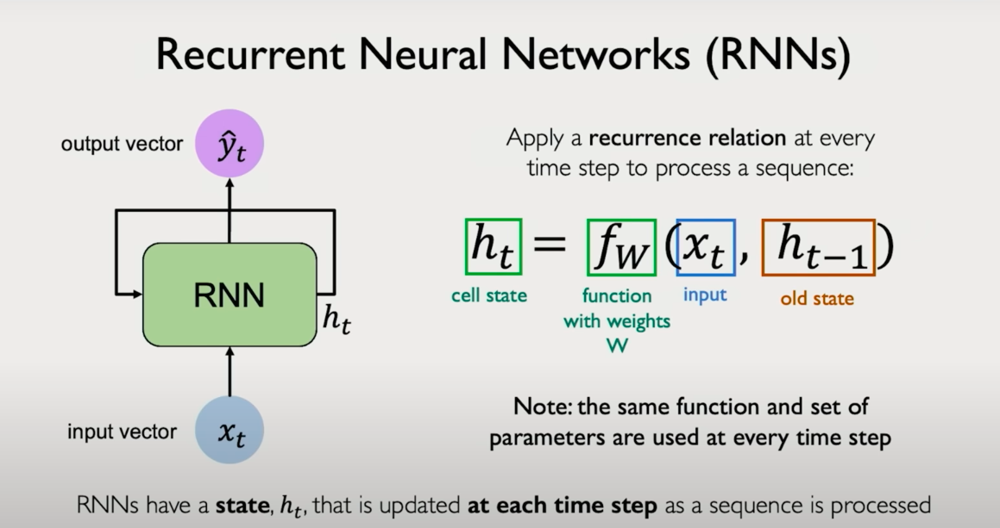
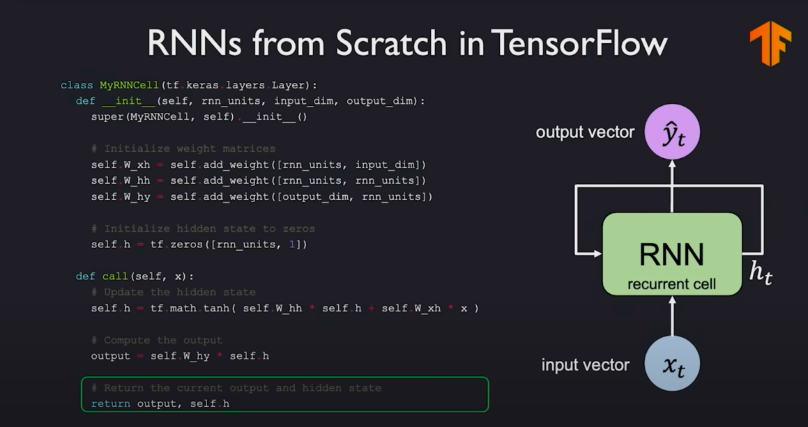
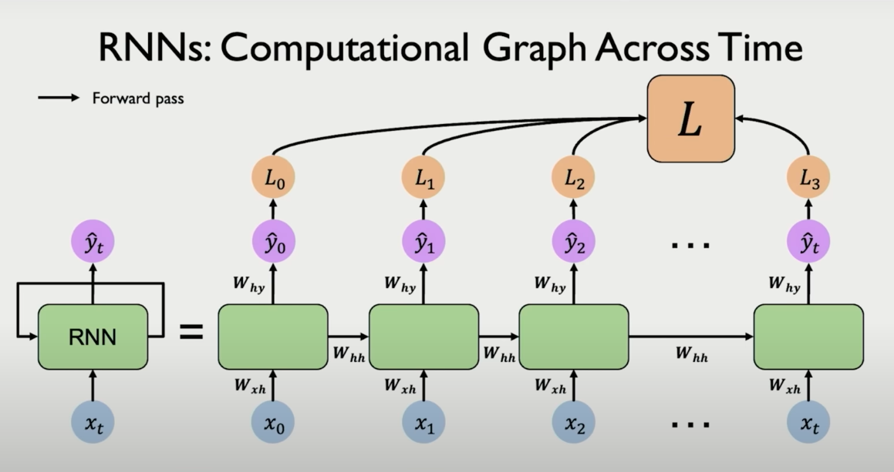
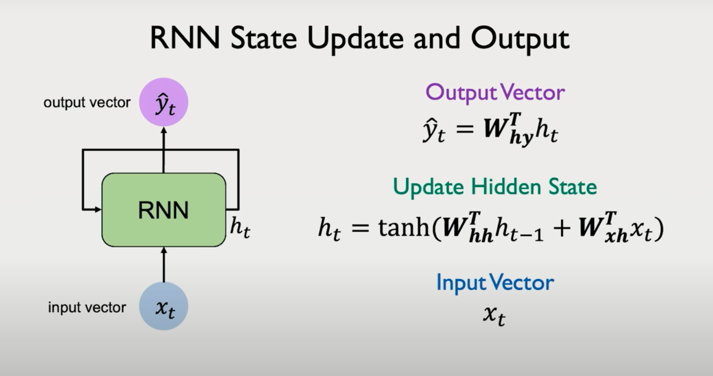
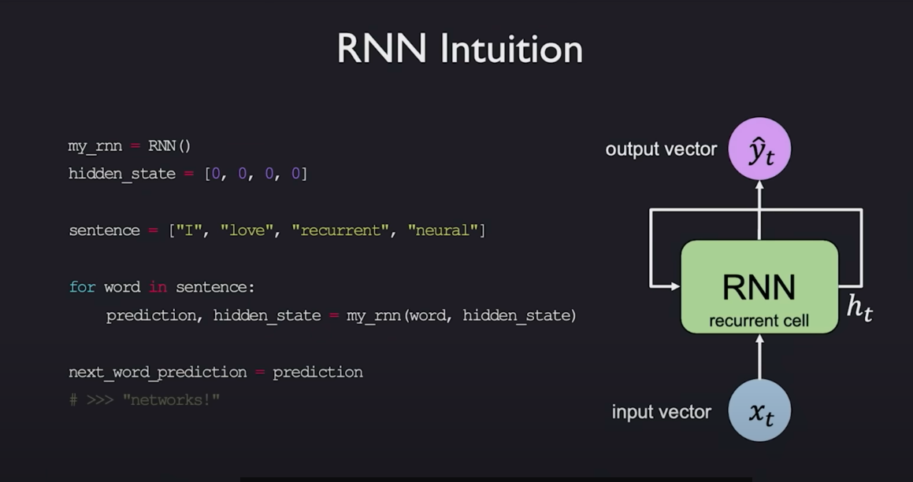

# Chapter 4: From Theory to Practice: Bringing Sequence Modeling to the Real World

Now that we’ve laid a foundation for understanding recurrent neural networks (RNNs) — how they carry memory across time steps, how they update internal states, and how they generate outputs — let’s consider what it means to operationalize this framework in the real world.

## Why Are Sequences Different?

Sequences — especially in domains like natural language — are rich, diverse, and challenging. Unlike images, which usually have fixed dimensions (like 224×224 pixels), sequences vary:

- Some are short (“Hi.”),
- Others are long (“This morning I took my cat for a walk because the weather was finally good.”),
- And many lie somewhere in between.

But length isn’t the only complexity. The meaning of an element in a sequence is often highly contextual. Consider:

> “This morning I took my cat for a walk…”

The choice of the next word ("outside", "again", or even "reluctantly") could depend on information at the very beginning of the sentence. This is the **long-range dependency problem** — a core reason why modeling sequences is more complex than modeling fixed-size inputs.

This makes **order and context** essential properties that any good sequence model must capture. And that’s precisely the role of models like RNNs.

## A Real-World Use Case: Next Word Prediction

To understand how RNNs apply in practice, let’s take a classic problem: **predicting the next word in a sentence**.

Why this task? Because it’s not just intuitive — it's also foundational. Modern language models, including the ones that power tools like ChatGPT, are built upon the ability to predict the next word given a sequence of previous words.

Take the sentence:

> "This morning I took my cat for a walk"

We want our model to take this sequence and predict what comes next. Is it *"outside"*? *"to the park"*? *"again"*? That prediction depends on both the input words **and their order**.

But before any model can process this sequence, we need to address a very important question:

### How Do We Feed Words into a Neural Network?

Neural networks don’t understand raw text. They only operate on numbers — specifically, vectors. So, the first step in sequence modeling is:

### Vectorizing the Input: From Words to Numbers

Here’s how that happens:

- **Define a Vocabulary**:  
  All possible words the model might encounter are placed in a finite vocabulary, say,  
  $$  \( V = \{ \text{"I"}, \text{"cat"}, \text{"walk"}, \ldots \} \)$$

- **Assign Indices**:  
  Each word is mapped to a unique index. For instance:  
  "I" → 1, "cat" → 2, "walk" → 3, etc.

- **Convert Indices to Vectors (Embeddings)**:  
  We transform each index into a fixed-length vector, either by:  
  - Using a one-hot encoding (a binary vector where only one index is 1), or  
  - Using a learned embedding: a dense, low-dimensional vector trained such that similar words (like “cat” and “dog”) have similar representations.

This transformation gives us a numerical representation of language that RNNs can operate on.

## Why Modeling Sequences is Still Hard

Even with well-structured vector inputs, sequence modeling remains challenging due to:

- **Variable Lengths**:  
  Our model must handle inputs of all sizes — from a 3-word sentence to a 30-word one — without losing context or performance.

- **Long-Term Dependencies**:  
  Information at the start of a sequence may be critical for predicting something at the end. Basic RNNs often struggle to remember such long-term information due to issues like vanishing gradients.

- **Order Sensitivity**:  
  Unlike bag-of-words models, RNNs need to capture the **exact ordering** of words. For example:  
  - “dog bites man” vs. “man bites dog” — same words, completely different meaning.

This is why architectures like **LSTMs** and **GRUs** were developed — to improve upon standard RNNs by better capturing long-range dependencies.

## Why This Matters

Understanding sequence modeling isn’t just about RNNs. It’s the foundation for models that do:

- **Machine Translation**: Translating one sentence to another.  
- **Speech Recognition**: Converting audio waves into words.  
- **Text Generation**: Autocompleting sentences or generating articles.  
- **Dialogue Modeling**: Powering assistants that respond to questions coherently.

And while RNNs are a start, you’ll soon see why their limitations pushed the community toward **attention-based models** and **transformers** — architectures that address many of the pain points we’ve just discussed.

In our next step, we’ll dive deeper into those limitations and begin exploring how models like **LSTMs** and **GRUs** tackle long-term dependencies more effectively — setting the stage for even more powerful sequence modeling paradigms.
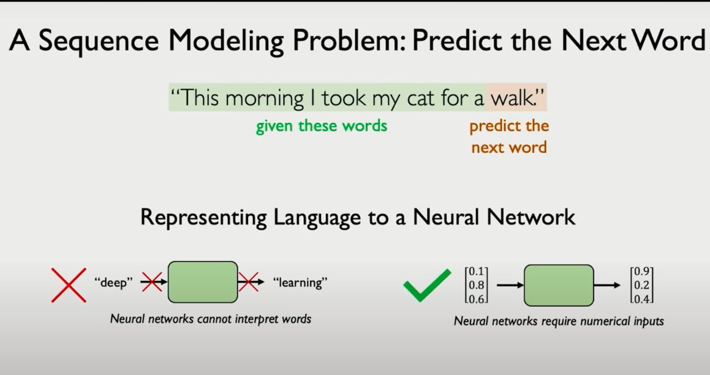
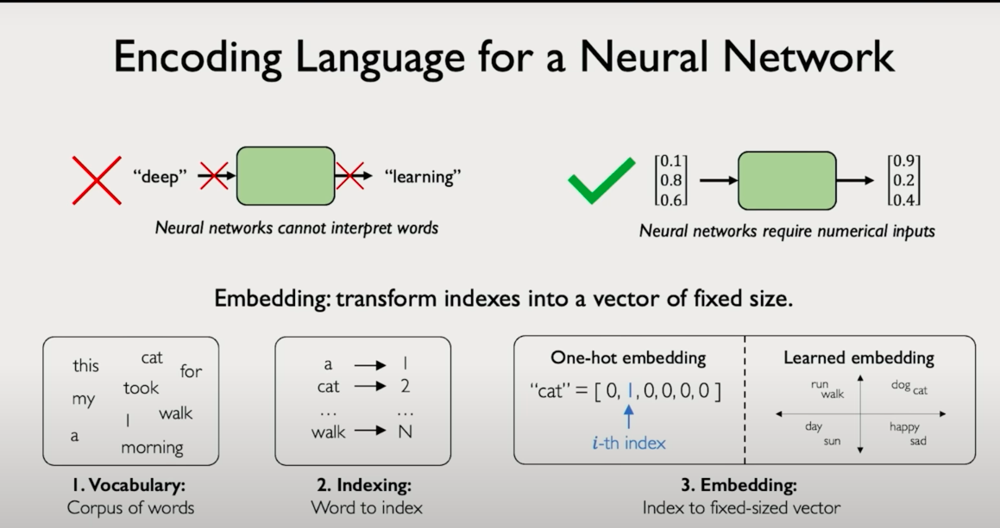
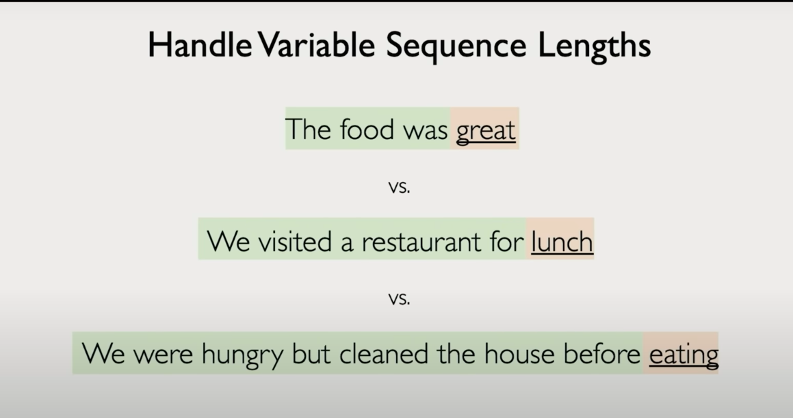
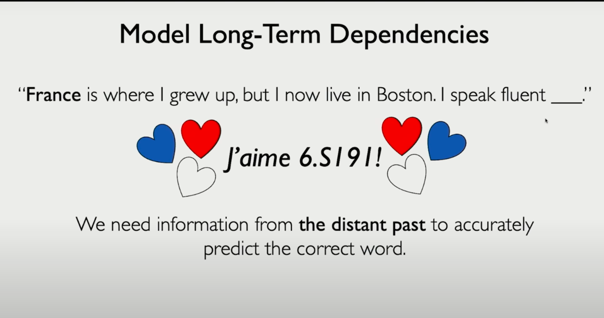
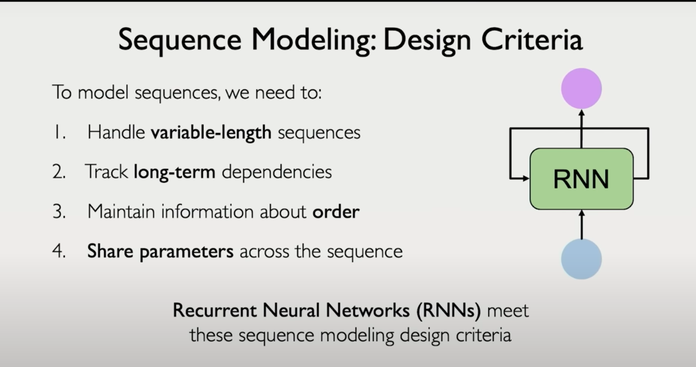

# Chapter :5 Training RNNs: From Backpropagation to Backpropagation Through Time

Even though sequence models like RNNs require special considerations, they’re still trained using the same fundamental algorithm that underpins most of modern deep learning: backpropagation.  
Let’s revisit that core idea and then see how it extends to recurrent models.

## Backpropagation in Feedforward Networks: A Recap

In feedforward neural networks, training follows a simple loop:

**Forward Pass:**  
Input data flows through the network to produce an output.

**Loss Computation:**  
A loss function measures the error between the predicted output and the true target.

**Backward Pass (Backpropagation):**  
The loss is differentiated with respect to the model’s parameters — layer by layer — using the chain rule.

**Parameter Update:**  
Weights are updated using the gradient descent rule to minimize the loss.

This process is repeated across batches of data until convergence.

## Extending to RNNs: The Need for Temporal Backpropagation

In the case of recurrent neural networks, we face an added challenge: temporal dependencies.  
Rather than a single forward pass through a static network, an RNN unfolds over time. At each time step:
- It takes in a new input,  
- Updates its hidden state,  
- Produces an output,  
- And contributes to the total loss.

This means the total loss is not just from one output, but is the sum of losses across time steps.  
To train such a model, we need to backpropagate not only through the layers of the network, but also backward through time — across each time step where the hidden state was reused.  
This is the motivation for a specific training algorithm:

## Backpropagation Through Time (BPTT)

Backpropagation Through Time (BPTT) is the extension of backpropagation to recurrent structures. Here's what it involves:
- Unroll the RNN across the sequence length, treating each time step as a separate layer (sharing weights).  
- Compute the total loss as the sum over all time steps.  
- Backpropagate gradients from the final time step back to the initial one, flowing errors backward through both layers and time.

This backward flow must propagate through a chain of repeated computations — the same weight matrices and activation functions applied again and again at each step.

## Practical Challenge: Vanishing and Exploding Gradients

This repeated multiplication creates a major numerical challenge:  
If the derivatives at each step are slightly greater than one, the gradients can explode exponentially.  
If they’re less than one, the gradients can vanish — shrinking toward zero.

This problem is particularly damaging in sequence modeling because it prevents the model from learning long-term dependencies. If gradients either blow up or vanish, the model can’t effectively use early sequence information to make late predictions.

## Why This Matters

This issue isn't just theoretical. In practice, it severely limits the capacity of vanilla RNNs to:
- Learn from long sequences, where important information might occur far from the prediction target,  
- Retain stable training dynamics, which are essential for convergence,  
- Capture meaningful temporal patterns over extended contexts.

## A Solution: Long Short-Term Memory (LSTM)

To address this, the deep learning community proposed enhanced RNN architectures — ones that modify the recurrent unit itself to better regulate the flow of information and gradients.  
The most well-known of these is the Long Short-Term Memory (LSTM) network.

### What LSTMs Do Differently:

LSTMs introduce gates — learned mechanisms that selectively control what information to keep, forget, and expose at each time step. This makes them far more robust to the vanishing and exploding gradient problems.  
By introducing explicit memory cells and gating functions, LSTMs can:
- Retain information across long time spans,  
- Learn what to forget and what to remember,  
- Maintain stable gradients during training.
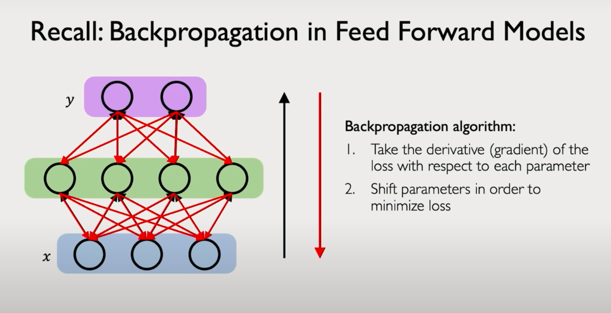
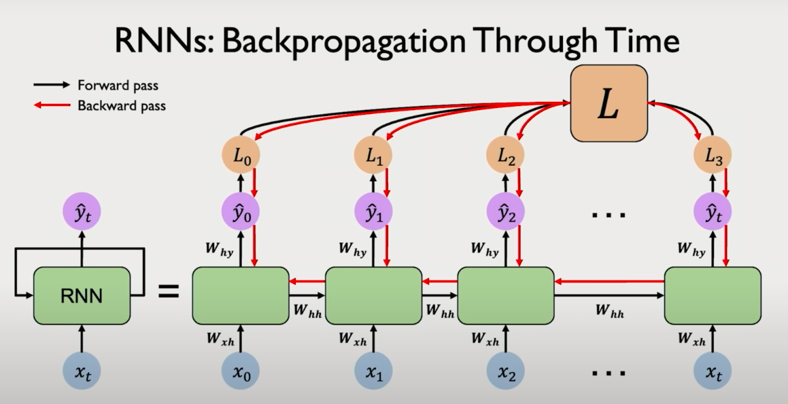
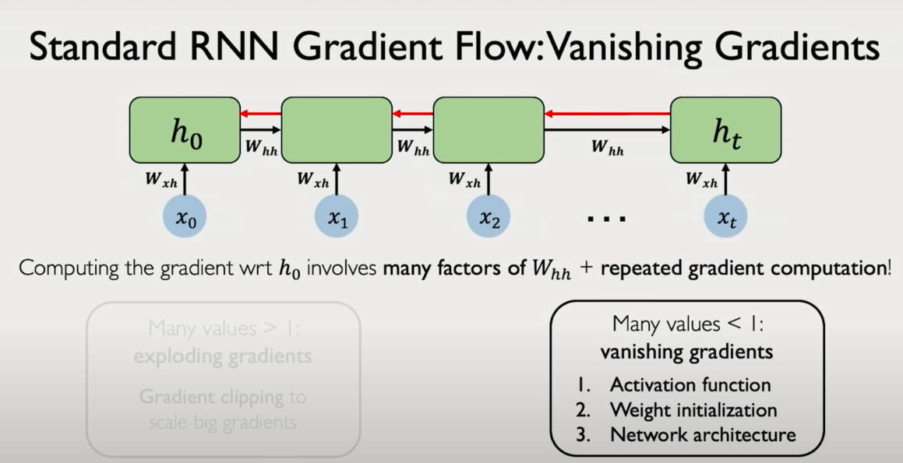
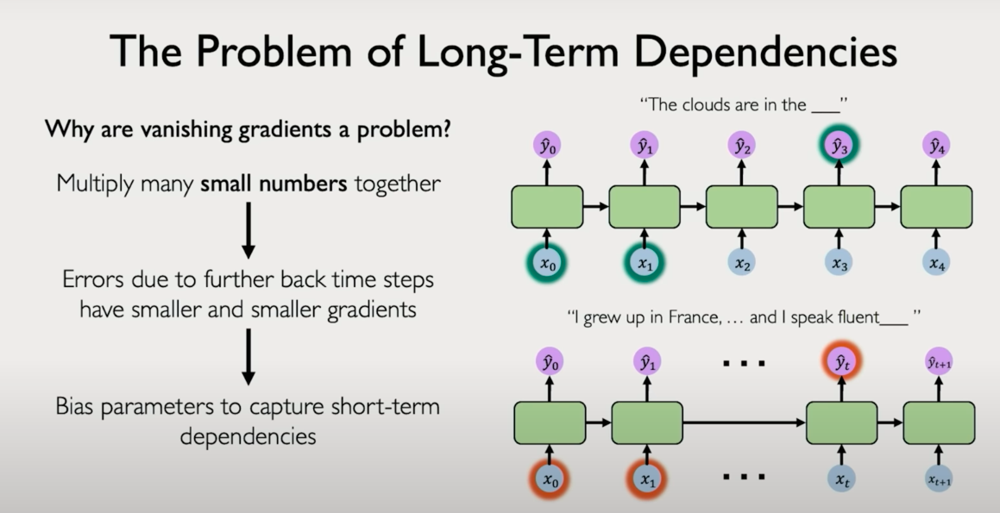
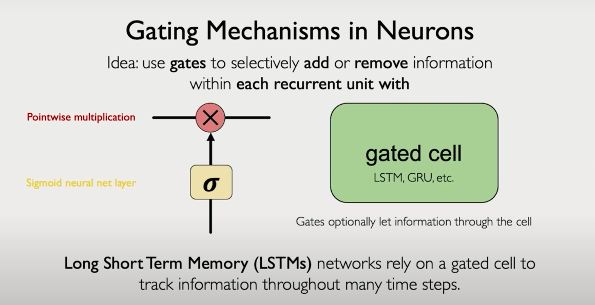

# Chapter :6 Applications of RNNs: Music Generation

To ground our understanding of sequence modeling in a tangible example, let’s look at music generation, a domain that naturally aligns with the structure of recurrent neural networks (RNNs).

Imagine you are trying to compose a new piece of music. One approach is to model the task similarly to next-word prediction in language: given a sequence of past musical notes, predict the most likely next note. RNNs are well-suited to this task because they are inherently designed to capture dependencies across sequential data, like notes in a melody.

In today’s hands-on lab session, you will build and train an RNN model capable of generating entirely new music. By learning from existing compositions, your model will generate sequences that have never existed before — a creative fusion of data and pattern recognition.

This is not just a theoretical exercise. Years ago, a startup trained a neural network on classical music to complete a famous unfinished symphony by Franz Schubert. The model was given the first two movements and tasked with generating the third. The result was surprisingly compelling and offered a glimpse into the creative potential of sequence modeling.

## Reflecting on RNNs: Power and Limitations

So far, we have focused exclusively on RNNs as the core architecture for sequence modeling. It is remarkable how we can start from basic principles and build toward something capable of generating music or modeling complex sequences.  
However, as with any technique, RNNs have inherent limitations. These limitations have driven the development of new architectures and improved variants that attempt to address the shortcomings.

### Fixed-Length Bottleneck  
The hidden state of an RNN is a fixed-length vector. Regardless of the length or richness of the input sequence, all the information must be compressed into a vector of predefined size. This creates a bottleneck and restricts the model’s ability to retain nuanced details from long sequences.

### Sequential Processing Constraint  
RNNs operate one time step at a time. While this allows them to handle temporal dependencies, it makes them difficult to parallelize. In contrast to models that process all inputs simultaneously, RNNs must process inputs in order, slowing down training and inference.

### Limited Long-Term Memory  
Due to the bottleneck in hidden states and the sequential nature of the architecture, RNNs often struggle to maintain dependencies over long ranges. This is particularly problematic in tasks where information from the start of the sequence is crucial for predictions at the end.

## Rethinking Sequence Modeling: Beyond Recurrence

To address these challenges, we revisit the fundamental goal of sequence modeling:  
Given a sequence of inputs, compute a representation that captures dependencies within the sequence and use that representation to generate useful outputs.

With RNNs, we achieve this by processing inputs one time step at a time. But what if we could avoid processing data sequentially? Could we eliminate recurrence entirely?

An early idea was to concatenate all inputs into one large vector, pass it through a feedforward network, and generate an output. This does eliminate recurrence, allowing us to process all inputs in parallel.

However, it introduces two major problems:
- It becomes inefficient and computationally expensive for long sequences.
- It destroys the ordering of the sequence. Once the inputs are concatenated, we lose information about which parts came earlier or later, and we cannot model the relationships between distant tokens.

## The Rise of Attention: Learning What Matters

This realization inspired a new approach — rather than encoding everything into a single vector or processing step by step, can we allow the model to selectively focus on the most relevant parts of the sequence?

## This leads us to the concept of attention.  
The idea is simple but powerful. Given a sequence, define a mechanism that can identify and attend to the important elements, regardless of their position in the sequence. By doing this, we can model dependencies directly and more flexibly.

Attention allows models to learn which parts of the input are most important for a given output — whether those parts are nearby or far away in the sequence.

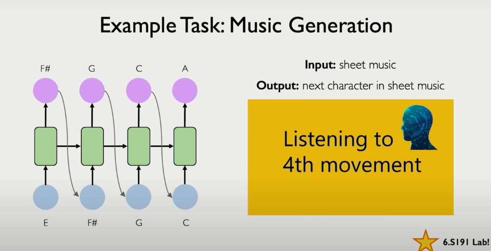
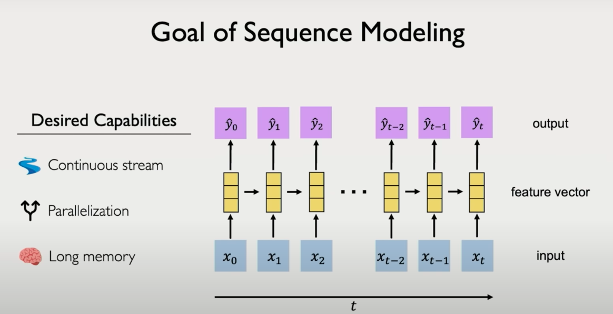
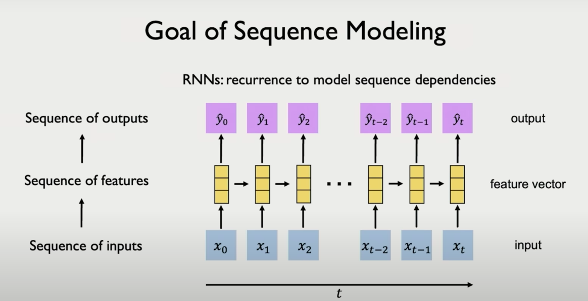
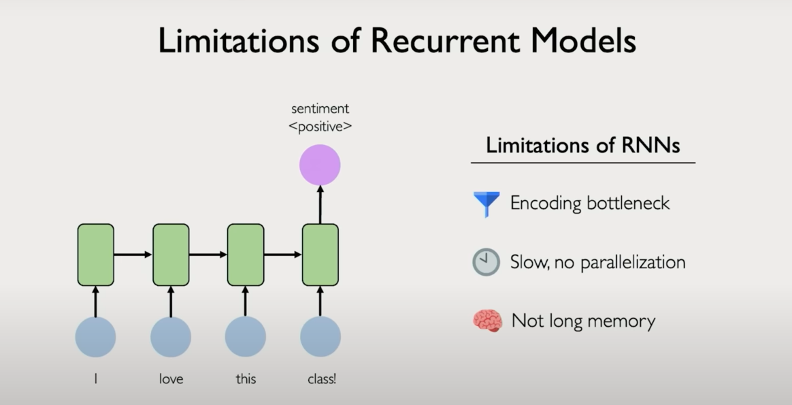
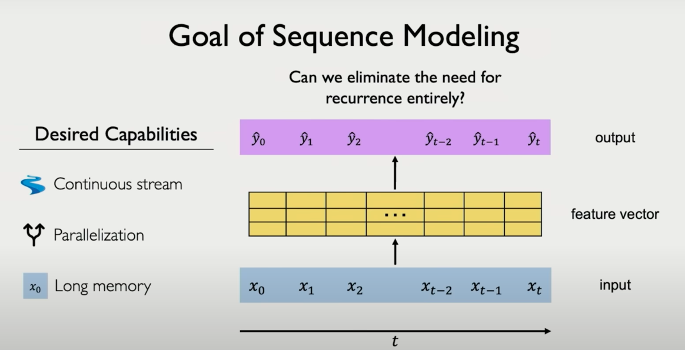
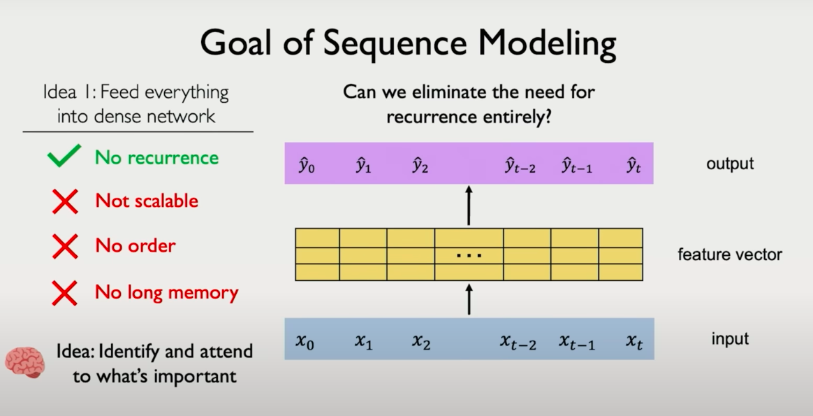

# Chapter :7 The Core Idea Behind Attention and Transformers

This is the core idea of a very powerful mechanism called attention. In 2017, a seminal paper titled "Attention is All You Need" introduced this mechanism. If you've heard of models like ChatGPT or GPT, the "T" stands for Transformer. A Transformer is a type of neural network architecture that can be applied not only to language data but also to other types of sequential data.

What makes Transformers different is their use of the attention mechanism. In this lecture, we will explore the attention mechanism in detail, and in later sessions, you’ll learn how Transformers are used in language models and other real-world applications.

## Understanding Attention: A Human Analogy

The term "attention" is quite intuitive. As humans, we have a remarkable ability to focus on specific parts of an input — to attend to what matters. Let's build up our intuition using an example. Suppose you're looking at an image. A naive approach would be to scan each pixel one by one to figure out what’s important. But our brains do not work like that. We instantly focus on salient parts of the image.

This act of identifying and focusing on the important parts of an input is the first part of what attention mechanisms aim to replicate. The next part is extracting useful features based on this attention. Think of this as identifying what matters and then pulling out the meaningful bits.

## Attention as Search

Conceptually, attention is very similar to search. Suppose you have a question like “How can I learn more about neural networks and AI?” One way to get an answer would be to search on the Internet. You enter your query into YouTube, and the search system goes through a massive video database. For each video, a key descriptor — is extracted to represent the core content.

You then compare your query to all those keys. If the match is high, it means the video is relevant. If not, it gets ignored. Once a match is found, you extract the associated value — which, in this case, is the actual video. This process of comparing the query to the keys, and then pulling out the value, forms the core of attention mechanisms.

## Attention in Neural Networks

Now let’s return to our sequence modeling task. Suppose you are trying to predict the next word in a sentence. With attention, instead of processing the sentence one word at a time like RNNs, we feed in the whole sequence at once. To preserve information about order, we introduce positional embeddings — additional encodings that help the model keep track of the relative position of each word.  
These position-aware inputs are then used to compute three sets of vectors using learned neural network layers:  
- Queries  
- Keys  
- Values

Each is derived from the same input but via different transformations, allowing each to capture different types of information. This setup is often referred to as self-attention, since the inputs are attending to each other within the same sequence.

## Similarity and Softmax Weights

Next, the model computes similarity scores between each query and each key. Since these are numeric vectors, we use the dot product to measure their similarity. The dot product tells us how aligned or relevant two vectors are.

These similarity scores are then passed through a softmax function, which normalizes them into a distribution. This gives us attention weights, which indicate how much attention should be paid to each word in the sequence relative to others.  
For example, in the sentence:  
"He tossed the tennis ball to serve."  
Words like “tossed” and “ball” may receive high mutual attention scores due to their semantic relation, while unrelated words get lower scores.

## Extracting Features with the Value Matrix

The final step is to use these attention weights to compute a weighted sum of the value vectors. This yields an output representation that reflects the most relevant features in the sequence, according to the attention scores. This mechanism is the heart of the attention operation.

## Building Transformers

To build a Transformer model using this mechanism,  
we follow these steps:
- Start with the input sequence and apply positional encodings.  
- Compute the query, key, and value matrices using separate neural network layers.  
- Calculate attention scores using dot products between queries and keys, followed by softmax normalization.  
- Multiply the attention weights with the value matrix to get the final output features.

These computations form an attention head, and multiple such heads can be stacked in parallel to form a multi-head attention layer. Each head may focus on different parts or relationships in the input, increasing the expressive capacity of the model.

## Real-World Applications of Attention

The attention mechanism has revolutionized many fields:
- **Natural Language Processing:** Transformers power nearly all modern language models including GPT, BERT, and T5.  
- **Biology:** Transformers are used to model biological sequences, including DNA and protein structures.  
- **Computer Vision:** Vision Transformers (ViTs) apply attention to image patches instead of pixels, and have shown strong performance in tasks like classification, segmentation, and object detection.

You will get hands-on experience with these models, especially with LLMs (Large Language Models) in dedicated software labs.

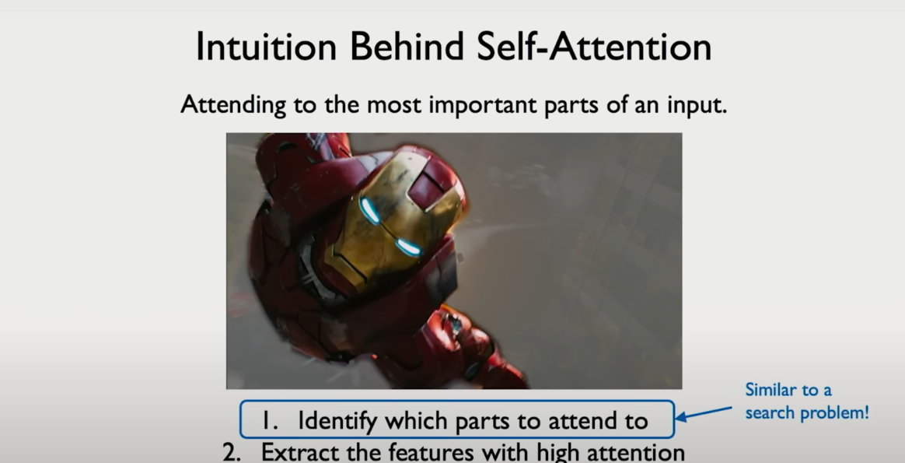
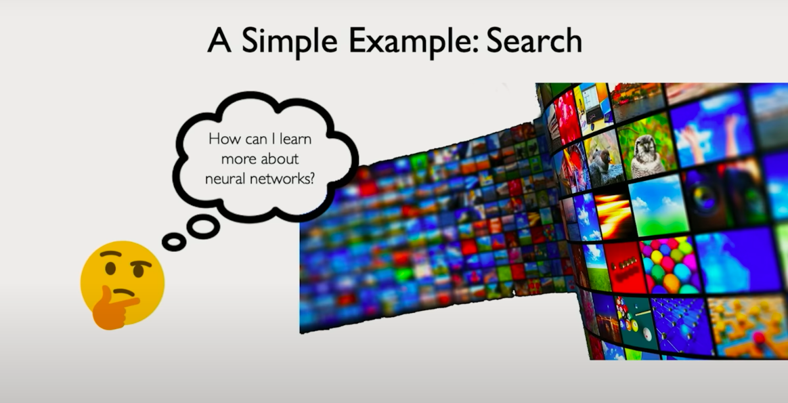
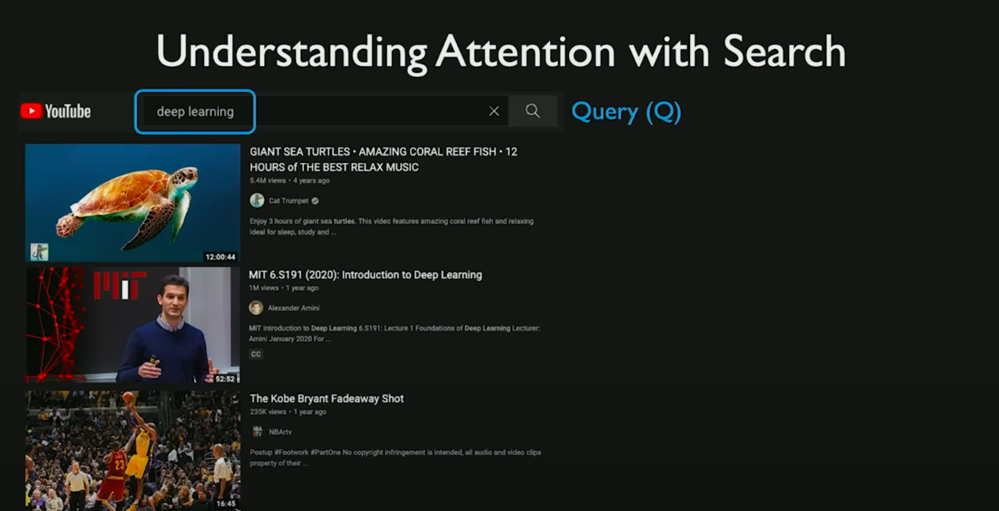
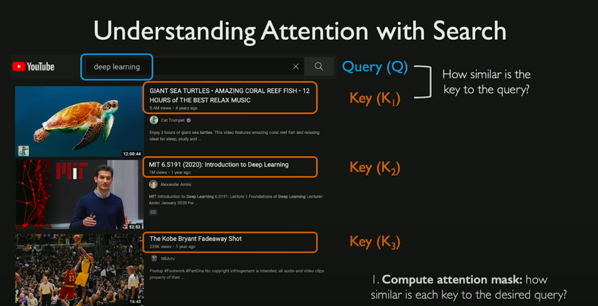
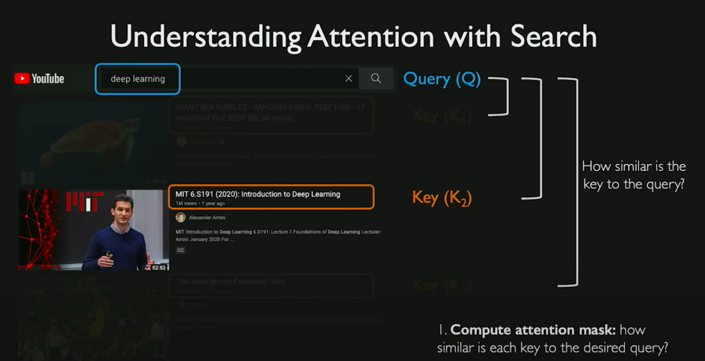
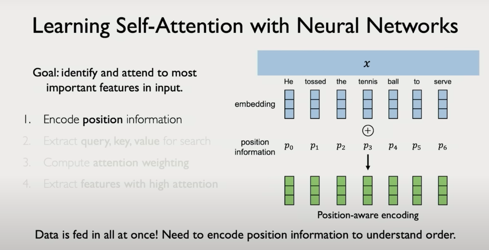
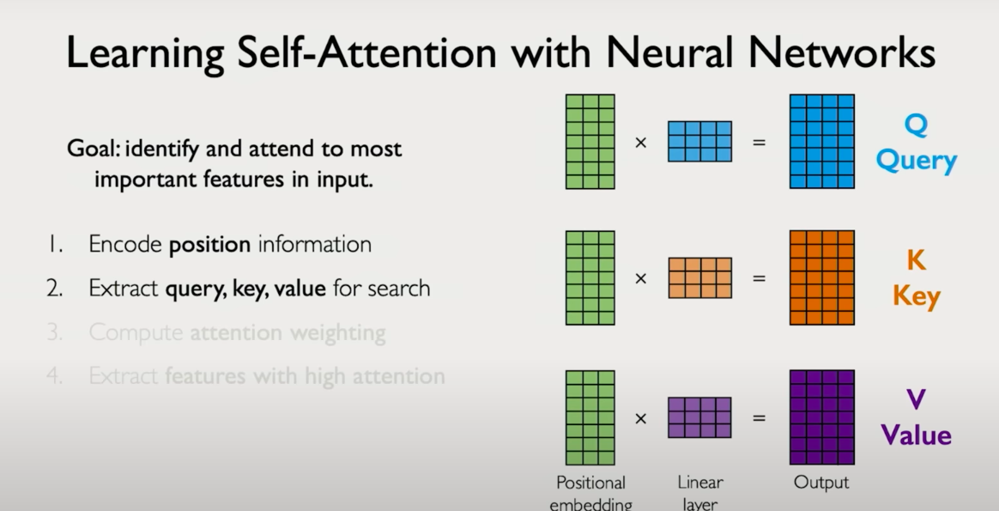
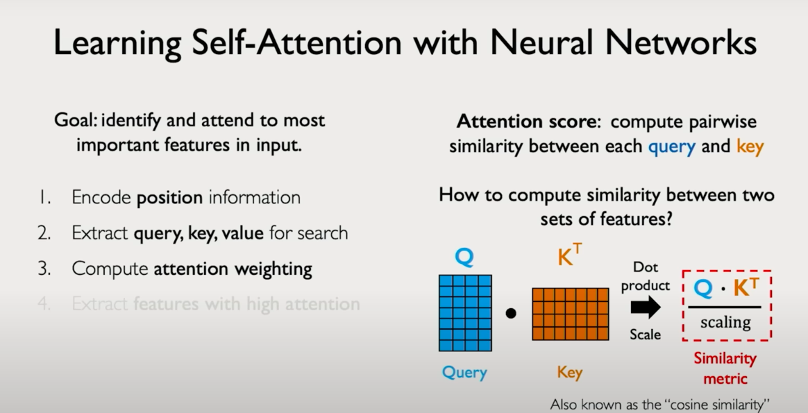
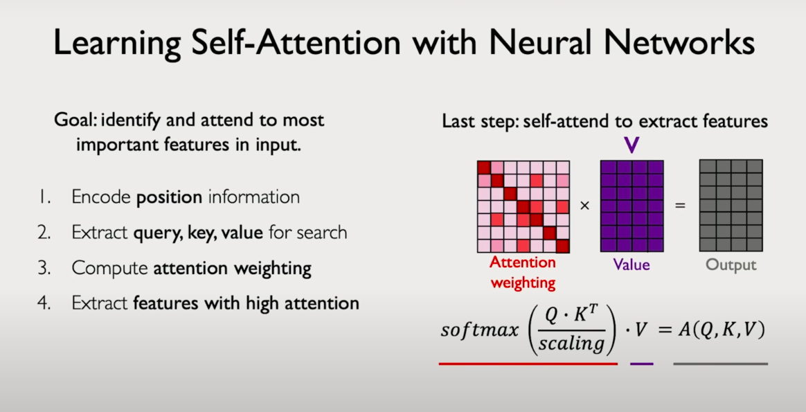
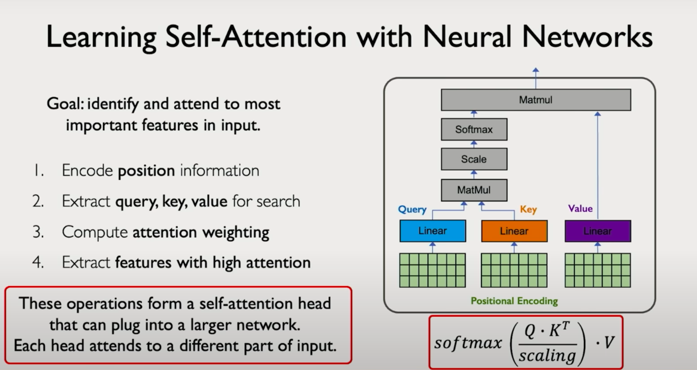
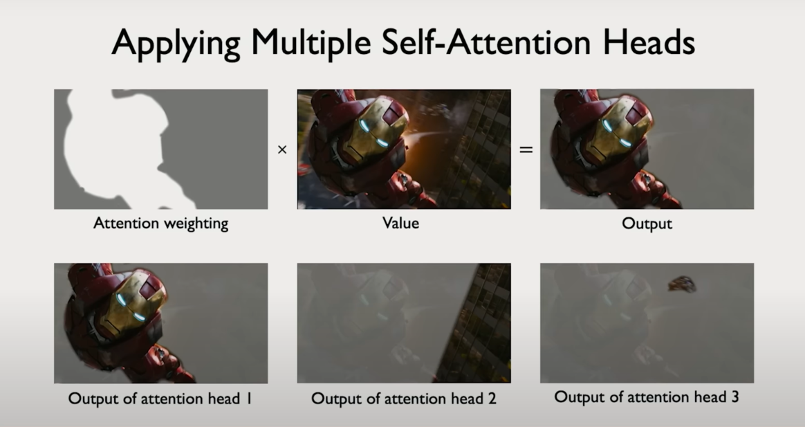
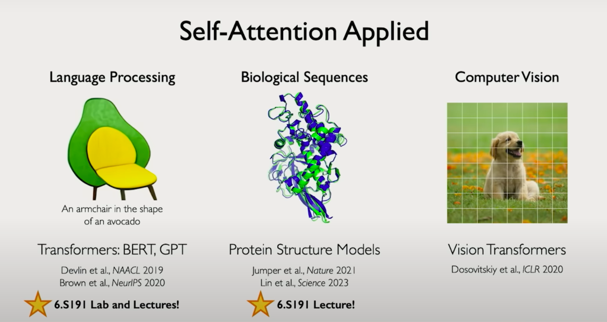
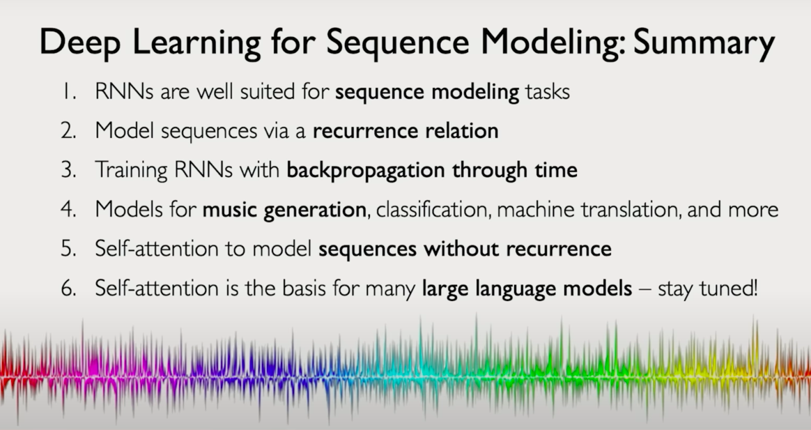
