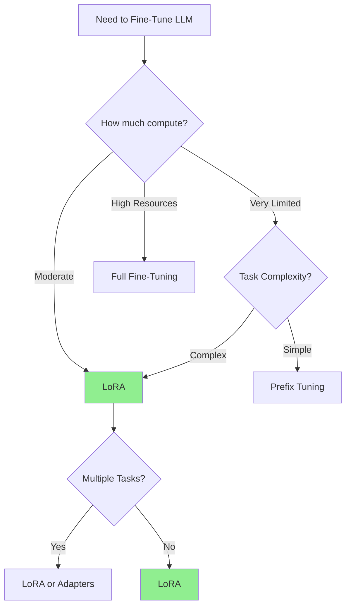

# LoRA Fine-Tuning: Efficient Adaptation for Large Language Models

## Learning Objective

By the end of this module, you will understand how Low-Rank Adaptation (LoRA) works, why it was introduced as a solution to expensive fine-tuning, how it modifies transformer weights efficiently, and how to use it to fine-tune large models for specific downstream tasks.

---

## 1. Motivation: Why Fine-Tuning Needs to Change

### The Problem with Full Fine-Tuning

Traditional fine-tuning of large language models involves updating **all parameters** in the network. For modern LLMs, this presents several critical challenges:

- **Billions of parameters**: Models like Llama-2-7B have 7 billion parameters, GPT-3 has 175 billion
- **Massive GPU/VRAM requirements**: Fine-tuning requires storing gradients, optimizer states, and activations for every parameter
- **High computational costs**: Training can take days or weeks on expensive GPU clusters
- **Storage overhead**: Each fine-tuned version requires saving the entire model

#### Real-World Example

Consider fine-tuning a 7B parameter model (like Llama-2-7B):
- **Full fine-tuning**: Requires 4× A100 GPUs (80GB each), costs ~$10-50 per hour
- **Storage**: Each fine-tuned checkpoint is ~14GB (for fp16)
- **Time**: Can take 10-100 GPU hours depending on dataset size
- **Total cost**: Easily $500-5000 per fine-tuning run

For many organizations and researchers, this is prohibitively expensive and often **unnecessary** — most downstream tasks don't require changing all 7 billion parameters!

### Enter Parameter-Efficient Fine-Tuning (PEFT)

The key insight: **What if we only need to update a small fraction of the model's parameters to adapt it to new tasks?**

This is where **LoRA** (Low-Rank Adaptation) comes in — a technique that reduces trainable parameters by 99% while maintaining comparable performance to full fine-tuning.

---

## 2. The Idea Behind LoRA

### Understanding the Core Concept

Recall that each linear layer in a transformer can be expressed as:

$$
y = Wx
$$

Where:
- $W \in \mathbb{R}^{d \times d}$ is the weight matrix
- $x$ is the input vector
- $y$ is the output vector

### The LoRA Innovation

Instead of updating the entire weight matrix $W$, LoRA adds **trainable low-rank matrices** $A$ and $B$:

$$
W' = W + \Delta W = W + BA
$$

Where:
- $A \in \mathbb{R}^{r \times d}$ — the "down-projection" matrix
- $B \in \mathbb{R}^{d \times r}$ — the "up-projection" matrix  
- $r \ll d$ — the **rank** (typically 4, 8, 16, or 32)
- $W$ remains **frozen** (not updated during training)
- Only $A$ and $B$ are trained

### Visualizing the Transformation

```
Original Layer:           LoRA-Enhanced Layer:
                         
Input (d) ──→ [W] ──→    Input (d) ──→ [W] ──────┐
                         (frozen)               (+)──→ Output (d)
   Output (d)                                    │
                                     ┌───[A]─────┘
                                     │   (r×d)
                              Input (d)
                                     │
                                   [B]
                                  (d×r)
```

### Parameter Count Comparison

For a single linear layer of dimension $d = 4096$ and rank $r = 8$:

- **Original parameters**: $d \times d = 4096 \times 4096 = 16,777,216$ parameters
- **LoRA parameters**: $d \times r + r \times d = 4096 \times 8 + 8 \times 4096 = 65,536$ parameters
- **Reduction**: ~**256× fewer parameters**!

For an entire 7B model with LoRA on all attention layers:
- **Trainable parameters**: Typically 4-40 million (0.05-0.5% of total)
- **Memory savings**: ~10-100× reduction in training memory

---

## 3. Why It Works

### The Low-Rank Hypothesis

The effectiveness of LoRA is based on the **intrinsic low-rank hypothesis**:

> "The updates required to adapt a pre-trained model to a new task lie in a low-dimensional subspace."

In other words, you don't need to modify the model in all directions — just a few key directions capture most of the meaningful adaptation.

### Mathematical Intuition

Consider the weight update $\Delta W$. In full fine-tuning:
- $\Delta W$ has rank up to $d$ (full rank)
- But empirically, most of the "signal" concentrates in a much smaller subspace

By constraining $\Delta W = BA$ where $\text{rank}(BA) \leq r$:
- We capture the most important directions of adaptation
- We ignore redundant or noisy updates
- We achieve a form of **implicit regularization**

### Why This Maintains Performance

1. **The frozen base model retains generalization**: The pre-trained weights $W$ capture broad language understanding from massive pretraining

2. **Low-rank updates capture task-specific patterns**: The $BA$ matrices learn the specific adaptations needed for your task

3. **Efficient gradient flow**: Backpropagation only updates $A$ and $B$, requiring much smaller gradient buffers

4. **Empirical validation**: Research shows LoRA with $r=8$ often matches full fine-tuning performance on many tasks

---

## 4. Implementation Sketch (PyTorch)

### Basic Setup with Hugging Face PEFT

The `peft` library (Parameter-Efficient Fine-Tuning) makes LoRA implementation straightforward:

```python
from peft import LoraConfig, get_peft_model
from transformers import AutoModelForCausalLM, AutoTokenizer

# Load the base model
model = AutoModelForCausalLM.from_pretrained(
    "meta-llama/Llama-2-7b-hf",
    torch_dtype=torch.float16,
    device_map="auto"
)

# Configure LoRA
lora_config = LoraConfig(
    r=8,                              # Rank of the low-rank matrices
    lora_alpha=32,                    # Scaling factor for LoRA weights
    target_modules=["q_proj", "v_proj"],  # Which layers to apply LoRA to
    lora_dropout=0.1,                 # Dropout for regularization
    bias="none",                      # Don't train bias terms
    task_type="CAUSAL_LM"             # Task type for the model
)

# Wrap the model with LoRA
lora_model = get_peft_model(model, lora_config)

# Check trainable parameters
lora_model.print_trainable_parameters()
# Output: trainable params: 4,194,304 || all params: 6,742,609,920 || trainable%: 0.06%
```

### Understanding the Key Parameters

#### `r` (Rank)
- Controls the dimensionality of the low-rank matrices
- **Lower values** (4, 8): Fewer parameters, faster training, less expressive
- **Higher values** (32, 64): More parameters, better performance on complex tasks
- **Typical range**: 4-16 for most tasks, 32-64 for very complex domains

#### `lora_alpha`
- Scaling factor applied to the LoRA weights: $\Delta W = \frac{\alpha}{r} \cdot BA$
- Acts as a learning rate multiplier for LoRA layers
- **Typical value**: 16-32 (often 2× the rank)
- **Higher alpha**: Stronger influence of LoRA updates

#### `target_modules`
- Specifies which linear layers get LoRA adapters
- Common choices:
  - **Attention layers**: `["q_proj", "v_proj"]` (most efficient)
  - **All attention**: `["q_proj", "k_proj", "v_proj", "o_proj"]` (more expressive)
  - **Attention + FFN**: Include `["gate_proj", "up_proj", "down_proj"]` (maximum adaptation)

### Complete Training Example

```python
from transformers import TrainingArguments, Trainer
import torch

# Prepare your dataset
train_dataset = ...  # Your tokenized dataset

# Training arguments
training_args = TrainingArguments(
    output_dir="./lora-llama2-finetuned",
    num_train_epochs=3,
    per_device_train_batch_size=4,
    gradient_accumulation_steps=4,
    learning_rate=2e-4,              # Higher LR often works well with LoRA
    fp16=True,                       # Mixed precision training
    logging_steps=10,
    save_strategy="epoch"
)

# Create trainer
trainer = Trainer(
    model=lora_model,
    args=training_args,
    train_dataset=train_dataset,
)

# Train!
trainer.train()

# Save only the LoRA adapters (typically ~10-50MB)
lora_model.save_pretrained("./my-lora-adapter")
```

### Loading and Using Your Fine-Tuned Model

```python
from peft import PeftModel
from transformers import AutoModelForCausalLM

# Load base model
base_model = AutoModelForCausalLM.from_pretrained("meta-llama/Llama-2-7b-hf")

# Load your LoRA adapter
model = PeftModel.from_pretrained(base_model, "./my-lora-adapter")

# Use it for inference
tokenizer = AutoTokenizer.from_pretrained("meta-llama/Llama-2-7b-hf")
inputs = tokenizer("Explain quantum computing:", return_tensors="pt")
outputs = model.generate(**inputs, max_length=100)
print(tokenizer.decode(outputs[0]))
```

---

## 5. Key Benefits

### 1. Massive Parameter Reduction
- **90-99.5% fewer trainable parameters** compared to full fine-tuning
- A 7B model might only train 4-40M parameters with LoRA

### 2. Memory Efficiency
- **10-100× less GPU memory** required for training
- Enables fine-tuning on consumer GPUs (single RTX 3090 or 4090)
- No need for distributed training setups for moderate-sized models

### 3. Storage Efficiency
- LoRA adapters are typically **10-100MB** vs. 10-100GB for full models
- Easy to store and share multiple fine-tuned versions
- Can switch between different task-specific adapters on the fly

### 4. Training Speed
- **2-3× faster training** due to fewer parameters to update
- Faster convergence in many cases
- Lower computational costs overall

### 5. Modularity and Composition
- Keep one base model and multiple adapters for different tasks
- Can even combine multiple LoRA adapters (adapter merging)
- Easy to version control and experiment with different adaptations

### 6. Preservation of Base Model Knowledge
- The frozen weights maintain broad capabilities from pretraining
- Reduces risk of catastrophic forgetting
- Better generalization on out-of-distribution examples

### 7. Accessibility and Democratization
- Makes fine-tuning accessible to individual researchers and small teams
- Reduces carbon footprint of ML research
- Enables rapid iteration and experimentation

---

## 6. Where It's Used

### Domain Specialization

LoRA excels at adapting general-purpose models to specific domains:

**Legal Domain**
- Fine-tune on legal documents, case law, contracts
- Model learns legal terminology and reasoning patterns
- Example: Document summarization, contract analysis

**Medical Domain**
- Adapt to medical literature, clinical notes, drug interactions
- Handles specialized medical vocabulary
- Example: Clinical decision support, medical Q&A

**Finance Domain**
- Train on financial reports, market analysis, regulatory filings
- Learns financial concepts and numerical reasoning
- Example: Earnings call analysis, risk assessment

### Instruction Tuning and Alignment

**Custom Instructions**
- Refine model behavior on company-specific instructions
- Control output format, tone, and style
- Example: Internal chatbot with specific guidelines

**Behavioral Refinement**
- Adjust response patterns without full retraining
- Fine-tune safety and alignment properties
- Example: Making the model more concise or detailed

### Enterprise Applications

**Customer Service Chatbots**
- Train on company-specific FAQs and support tickets
- Adapt to brand voice and policies
- 10-50MB adapter vs. hosting multiple full models

**Code Generation**
- Specialize on internal codebases and conventions
- Learn company-specific APIs and patterns
- Example: GitHub Copilot-like tools for proprietary code

**Content Generation**
- Adapt to specific writing styles or formats
- Fine-tune for marketing, technical writing, or creative content
- Example: Product description generation

### Edge and Resource-Constrained Deployment

**On-Device Models**
- Fine-tune smaller models (Llama-3-8B, Mistral-7B) for edge deployment
- Deploy to mobile devices or embedded systems
- Multiple adapters for different use cases, one base model

**Low-Resource Languages**
- Adapt to languages with limited training data
- More data-efficient than full fine-tuning
- Enables multilingual applications

### Research and Experimentation

**Rapid Prototyping**
- Test different task formulations quickly
- A/B test different fine-tuning approaches
- Iterate on prompt engineering + fine-tuning

**Multi-Task Learning**
- Train separate adapters for different tasks
- Share a single base model across tasks
- Efficient multi-tenant serving

---

## 7. Comparison with Other PEFT Techniques

### Overview of Parameter-Efficient Methods

| Method | Parameters Updated | Typical Use Case | Pros | Cons |
|--------|-------------------|------------------|------|------|
| **LoRA** | Low-rank adapters ($BA$) | Most general-purpose fine-tuning | Memory efficient, fast, versatile | Requires choosing rank $r$ |
| **Prefix Tuning** | Adds trainable prompt tokens | NLP tasks, conditional generation | Very few parameters (~0.01%) | Less effective for complex tasks |
| **Adapter Tuning** | Small bottleneck layers between transformer layers | Multitask setups, continual learning | Modular, easy to swap | Increases inference latency |
| **Prompt Tuning** | Only tunes soft prompts | Simple classification/generation | Extremely parameter-efficient | Limited expressiveness |
| **BitFit** | Only bias terms | Quick adaptation | Minimal overhead | Lowest performance |
| **(IA)³** | Learned rescaling vectors | Attention mechanisms | Very lightweight | Newest, less tested |

### Detailed Comparison

#### LoRA vs. Prefix Tuning

**Prefix Tuning** prepends trainable tokens to the input:
```
[learned_prefix_tokens] + [actual_input] → model → output
```

- **Pros**: Even fewer parameters than LoRA (~0.01-0.1%)
- **Cons**: 
  - Takes up sequence length (fewer tokens for actual input)
  - Less effective on complex reasoning tasks
  - Harder to interpret what the prefix represents

**When to use LoRA**: Most production scenarios, especially when task complexity is high

**When to use Prefix Tuning**: Extremely resource-constrained environments, simple classification tasks

#### LoRA vs. Adapter Tuning

**Adapter Tuning** inserts small bottleneck layers:
```
x → Transformer Layer → Adapter(·) → next layer
```

Where `Adapter(x) = W_up · ReLU(W_down · x) + x`

- **Pros**: 
  - Very modular (easy to add/remove)
  - Good for continual learning scenarios
  
- **Cons**:
  - Adds extra forward pass computation (slower inference)
  - Sequential bottleneck can limit expressiveness

**When to use LoRA**: When inference speed matters, when you want no architectural changes

**When to use Adapters**: When you need to frequently swap between many different tasks during inference

#### LoRA vs. Full Fine-Tuning

| Aspect | Full Fine-Tuning | LoRA |
|--------|-----------------|------|
| **Parameters** | 100% | 0.1-1% |
| **Memory** | ~4× model size | ~1.2× model size |
| **Training Time** | Baseline | 2-3× faster |
| **Storage** | 10-100GB per version | 10-100MB per adapter |
| **Performance** | Best (slight edge) | 95-100% of full FT |
| **Overfitting Risk** | Higher | Lower (implicit regularization) |

### Choosing the Right Method



**General Recommendations**:
1. **Start with LoRA** — it's the most versatile and well-tested
2. Use **Prefix Tuning** only for very simple tasks or extreme resource constraints
3. Consider **Adapters** if you need to switch between many tasks during inference
4. Use **Full Fine-Tuning** only if you have the resources and LoRA doesn't meet your performance bar

---

## 8. Takeaway and Visualization

### Core Concept Summary

```
┌─────────────────────────────────────────────────────────┐
│                    BASE MODEL                           │
│            (Frozen Weights - 7B params)                 │
│                                                         │
│  ┌──────────────────────────────────────────┐          │
│  │  Transformer Layer 1                      │          │
│  │    [W_q] [W_k] [W_v] [W_o]  ← Frozen     │          │
│  │      ↓     ↓     ↓     ↓                 │          │
│  │    +ΔW  +ΔW  +ΔW  +ΔW   ← LoRA (B·A)    │ ┐        │
│  └──────────────────────────────────────────┘ │        │
│                                                │        │
│  ┌──────────────────────────────────────────┐ │        │
│  │  Transformer Layer 2                      │ │        │
│  │    [W_q] [W_k] [W_v] [W_o]  ← Frozen     │ │ Only   │
│  │      ↓     ↓     ↓     ↓                 │ │ 0.5%   │
│  │    +ΔW  +ΔW  +ΔW  +ΔW   ← LoRA (B·A)    │ │ params │
│  └──────────────────────────────────────────┘ │        │
│                                                │        │
│  ... [24 more layers] ...                     │        │
│                                                ┘        │
└─────────────────────────────────────────────────────────┘
                        ↓
           Task-Specific Behavior
        (Medical, Legal, Finance, etc.)
```

### The LoRA Workflow

```
1. Start with Pre-trained Model
   └→ Llama-2-7B, GPT-3, Mistral-7B, etc.

2. Freeze All Weights
   └→ No updates to the 7B original parameters

3. Add LoRA Adapters
   └→ Inject low-rank matrices (B·A) into attention layers
   └→ Only 4-40M trainable parameters

4. Fine-Tune on Task Data
   └→ Train only the adapters (B and A)
   └→ 2-3× faster than full fine-tuning
   └→ Uses 10× less memory

5. Save Adapter Weights
   └→ ~10-50MB file (vs. 14GB for full model)

6. Deploy
   └→ Load base model + adapter
   └→ Can swap adapters for different tasks
```

### Key Formulas to Remember

**LoRA Transformation**:
$$
y = W'x = (W + BA)x = Wx + BAx
$$

**Parameter Reduction**:
$$
\text{Params}_{\text{LoRA}} = 2 \times d \times r \ll d^2 = \text{Params}_{\text{Full}}
$$

**Scaling Factor**:
$$
\Delta W = \frac{\alpha}{r} \cdot BA
$$

---

## Summary

LoRA (Low-Rank Adaptation) has revolutionized how we fine-tune large language models by:

1. **Reducing costs by 10-100×** through parameter-efficient training
2. **Enabling adaptation on consumer hardware** (single GPU fine-tuning)
3. **Maintaining performance** comparable to full fine-tuning
4. **Providing modularity** with small, swappable adapters
5. **Democratizing access** to fine-tuning for researchers and practitioners

Whether you're building domain-specific chatbots, instruction-tuning models for enterprise use, or experimenting with model customization, LoRA provides an efficient and effective path forward.

### Next Steps

- Try fine-tuning a small model (Llama-3-8B) with LoRA on your own dataset
- Experiment with different rank values and target modules
- Explore combining multiple LoRA adapters for multi-task scenarios
- Check out QLoRA (quantized LoRA) for even more efficiency

---

## Further Reading

- **Original Paper**: [LoRA: Low-Rank Adaptation of Large Language Models](https://arxiv.org/abs/2106.09685) (Hu et al., 2021)
- **PEFT Library**: [Hugging Face PEFT Documentation](https://huggingface.co/docs/peft)
- **QLoRA**: [Efficient Finetuning of Quantized LLMs](https://arxiv.org/abs/2305.14314)
- **Practical Guide**: [Fine-tuning LLMs with LoRA and QLoRA](https://www.philschmid.de/fine-tune-llms-in-2024-with-trl)

